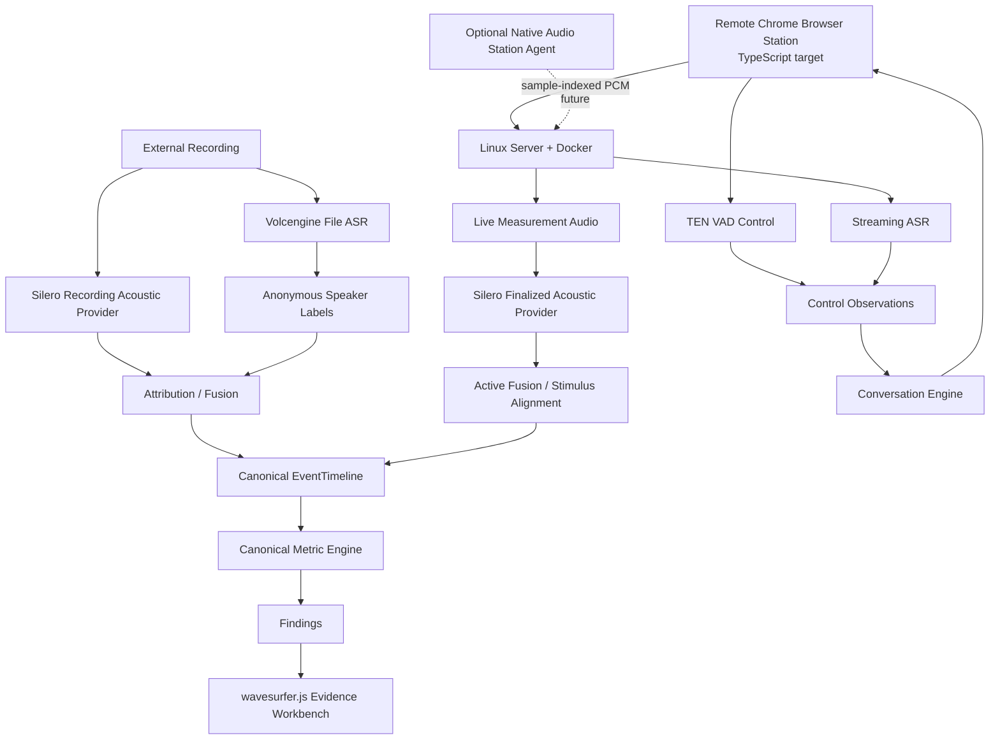

# AIVoiceBench 总体架构

> 本文约束 AIVoiceBench 的长期技术形态；产品范围、优先级、验收条件和实现状态以 [PRD](PRD.md) 为准，执行顺序见 [Roadmap](04-development-roadmap.md)。目标设计不等于已实现。
>
> 2026-09-16 架构决策：**Linux Server + Docker Backend + Remote Chrome Browser Station 是正式主架构，而不是权宜方案。** 原生 Windows 只作为未来专业 HIL/Audio Station Agent 的可选扩展。近期组件分工为 TEN VAD（Browser Control）、Silero VAD（Server finalized acoustic analysis）、火山 ASR 原生 speaker separation（Recording Analysis 当前 speaker clustering 主路径）和 wavesurfer.js（Evidence UI）。代码实现与真实设备验收状态不因本轮文档更新自动升级。
>
> 2026-09-17 实现语言决策：**Browser Station 的目标实现语言从当前 Vanilla JS 收敛为 TypeScript。** 这是 Browser Measurement Agent 的静态类型工程化，不是 React/Vue 等框架重写，也不改变 Python/FastAPI 后端、Docker/Chrome 交付拓扑、协议或 Measurement semantics。当前 JS 实现仍是代码事实，迁移由 [Issue #84](https://github.com/lybym/AIVoiceBench/issues/84) 跟踪，验证完成前保持 planned。

## 1. 项目定位

AIVoiceBench 是面向 **AI 语音终端、AI 玩具和语音智能体**的测试与评测 Harness，而不是普通语音聊天产品。

核心目标：

> **可观测、可复现、可比较、可解释、可回归的 AI Voice Test Harness。**

系统需要能够回答：

- 设备什么时候开始说话、什么时候结束；
- ASR、LLM、TTS 各阶段发生了什么；
- 多轮对话为什么进入下一轮；
- Barge-in、False Endpoint、异常恢复等行为如何发生；
- 最终测试结论对应哪些原始 Evidence；
- 不同设备、Provider 与语音技术栈之间的性能和行为差异。

架构优先级：

> **测试透明性 > 可观测性 > 可替换性 > 交互低时延优化。**

AIVoiceBench 的业务逻辑不以极低对话 RTT 为首要目标，因此可以把计算集中在远端 Linux Server；正式测量必须把时间真值留在测试现场。

## 2. 正式部署拓扑

```text
┌──────────────── Remote Test Site ────────────────┐
│ Remote Chrome Browser Station                    │
│ TypeScript target / current Vanilla JS           │
│                                                  │
│  Speaker ← stimulus playback                     │
│  Microphone → getUserMedia → AudioWorklet        │
│                        ↓                         │
│                 local sample counter             │
│                        ↓                         │
│           TEN VAD target / RMS fallback          │
│                        ↓                         │
│               UI / local control events          │
└───────────────────────┬──────────────────────────┘
                        │ HTTPS / WebSocket
                        ▼
┌──────────────── Linux Server ────────────────────┐
│ Docker / FastAPI                                 │
│ Run orchestration / Provider calls               │
│ durable audio / Artifact / Evidence              │
│ Silero finalized acoustic analysis               │
│ ASR / speaker separation / attribution / fusion  │
│ Canonical EventTimeline / Metric Engine           │
│ Judge / Findings / Revision / Report              │
└──────────────────────────────────────────────────┘
```

核心原则：

> **计算可以远，音频时间轴必须在现场生成。**

Browser Station 与 Server 之间的网络 RTT、WebSocket queue、server scheduler、ASR/LLM latency 可以影响控制过程，但不得被当作正式声学时延。

## 3. 当前技术栈与目标边界

| 层 | 当前/目标方案 |
| --- | --- |
| Backend deployment | Linux Server + Docker |
| Backend | Python 3.12 + FastAPI + Uvicorn |
| Remote client | Chrome Browser Station |
| Frontend | 当前 HTML/CSS/Vanilla JS；目标 TypeScript 源码 + 编译后浏览器 JS；不要求框架重写 |
| Browser audio | `getUserMedia` + `AudioWorklet` + Web Audio |
| Control transport | WebSocket / HTTPS |
| Control VAD | 当前 RMS；目标 TEN VAD Browser/WASM；RMS 保留 fallback |
| Server acoustic boundary | 当前 Energy VAD legacy；目标 Silero VAD baseline |
| Recording ASR | File ASR Provider，P0 默认火山极速版 HTTP；小文件 inline Base64，大文件对象存储 URL |
| Active ASR | StreamingASRProvider，近期优先火山 |
| Fixed TTS target | 火山 V3 WebSocket 单向流式；完整文本输入 → **MP3 流** → 冻结 MP3 Stimulus Artifact（#98） |
| Free TTS target | 火山 V3 WebSocket 双向流式；Streaming LLM text → **MP3 流** → streaming playback（#98） |
| Speaker separation | 当前优先使用火山 ASR-native anonymous speaker labels；3D-Speaker deferred |
| Waveform/Evidence UI | wavesurfer.js planned |
| Provider config | 目标：外置只读 `providers.yaml`；LLM/ASR/TTS 非敏感配置 source of truth |
| Object storage | 目标：外置只读 `storage.yaml`；首个 adapter 为私有 TOS，仅承担大文件 File ASR transport |
| Persistence | Run Artifact + mounted volume |
| Formal measurement | Active Measurement + Recording Analysis → Canonical EventTimeline → unique Metric Engine |
| Native Windows | 非当前正式交付；未来可选专业 HIL Station Agent |

当前实现基线仍以 PRD 的 `v0.4.0` 为准。文档中的 TypeScript、TEN/Silero/wavesurfer/远端部署决策属于 planned architecture，只有代码、测试和相应浏览器/容器/真实证据完成后才能升级状态。

## 4. Browser Station 与 Linux Server 职责

### 4.1 Browser Station

Browser Station 是现场执行端，负责：

- 扬声器播放测试 stimulus；
- 麦克风采集；
- AudioWorklet 连续 PCM；
- sample counter / frame sequence；
- provisional Control VAD；
- capture integrity；
- 浏览器权限、设备与 `MediaTrackSettings` 快照；
- 本地 UI、波形和 Evidence 交互；
- 断网/暂停/设备变化的失败状态。

Browser 不保存长期 Provider Credential，不运行正式 Metric 公式，不以 `Date.now()` 或 server response 生成声学真值。

远端正式部署使用 HTTPS/WSS。requested 与 actual `echoCancellation`、`noiseSuppression`、`autoGainControl` 必须进入 provenance。

Browser Station 当前实现位于 `aivoicebench/static/`，主要手写 JS 入口为 `app.js`、`models.js`、`voice_test.js` 和 `pcm_capture_worklet.js`。目标是按 #84 等价迁移到 TypeScript，使 audio frame、AudioWorklet message、sample index/sequence、VAD/control observation、capture integrity、media settings、WebSocket lifecycle 与 Fixed/Free Run state 具有显式类型。迁移后的 TypeScript 编译为普通浏览器 JavaScript，继续由现有 FastAPI/Docker 静态交付；不得借迁移改变 HTTP/WebSocket contract、PCM framing、Run/Turn identity 或正式时间基。

### 4.2 Linux Server

Linux Server + Docker 负责：

- Session / Run / TestCase 编排；
- Streaming/File ASR、LLM、TTS Provider；
- Measurement Audio / External Recording 持久化；
- Acoustic Boundary、speaker separation、Attribution、Fusion；
- Canonical EventTimeline；
- 唯一 Metric Engine；
- Judge / Findings；
- Human Revision；
- Report、Artifact 与 Evidence 管理；
- 多 Browser Station 的集中管理。

### 4.3 Configuration Plane

Provider 与 Storage 配置属于 Server Deployment Plane，不属于 Browser UI，也不属于 Measurement Evidence：

```text
/etc/aivoicebench/providers.yaml
    ├─ judge / File ASR / Streaming ASR / TTS profiles
    ├─ tts route: complete-text / asset synthesis
    ├─ streaming_tts route: streaming-text / streaming-audio session
    └─ capability routes

/etc/aivoicebench/storage.yaml
    └─ object-storage adapters / TTL / cleanup / credential references
```

长期 secret 不写入 YAML；配置文件只保存 env/secret reference。Docker 以 read-only mount 加载。Run 在启动时解析一次有效配置，并只把**非敏感 resolved snapshot**写入 provenance。

当前 SQLite model settings 是兼容现状；[Issue #87](https://github.com/lybym/AIVoiceBench/issues/87) 完成后，外置文件成为 source of truth，禁止 SQLite 与文件配置静默双写/合并。

## 5. 两条独立正式 Measurement Pipeline

AIVoiceBench 长期保持两条一级正式测量链。它们共享 Canonical Measurement Semantics，不共享 Audio Evidence。

### 5.1 Recording Analysis

```text
External Recording
   ├─ Silero VAD target ───────────→ acoustic boundary evidence
   ├─ Volcengine File ASR ─────────→ text / timestamps
   │                                  + anonymous speaker labels
   └─ semantic / manual evidence
                     ↓
             Attribution + Fusion
                     ↓
             Canonical EventTimeline
                     ↓
             Canonical Metric Engine
                     ↓
           Judge / Findings / Report
                     ↓
             wavesurfer Evidence UI
```

External Recording 是自己的正式声学原件。File ASR 的 provider timestamp 和 speaker labels 是 Evidence，不自动成为 acoustic truth 或 tester/device role truth。

### 5.2 Active Measurement

```text
Browser Station
Mic → AudioWorklet → sample-indexed PCM
       ├─ TEN VAD target → provisional control events
       └─ WebSocket → Linux Server
                       ↓
              ART-live-measurement-audio
                       ↓
                 Silero finalized replay
                       ↓
               Stimulus Alignment / Fusion
                       ↓
               Canonical EventTimeline
                       ↓
               Canonical Metric Engine
```

Active Measurement 可以独立形成 Final Measurement Result，不需要 External Recording “转正”。External Recording 仍可用于独立复测与 Measurement Equivalence。

## 6. 时间模型

正式 Active 声学时间：

```text
audio_relative_ms = sample_index * 1000 / sample_rate
```

时间来源分工：

| Time source | 用途 | Formal acoustic truth? |
| --- | --- | --- |
| Browser audio sample index | speech/event boundary | **Yes, primary timebase** |
| client monotonic | browser scheduling/debug | No |
| server monotonic | processing/transport diagnostics | No |
| wall clock | audit/coarse correlation | No |
| WebSocket receive time | network jitter/backpressure | No |
| ASR provider timestamp | ASR evidence | No, unless explicitly fused under policy |
| playback callback | stimulus alignment search prior | No |

不同设备时钟不得未经 mapping 直接相减。

## 7. VAD / Acoustic Boundary 架构

VAD 是 Acoustic Boundary Evidence Producer，不是所有 ASR 的必经前置。

```text
AcousticSegmenter
├─ EnergyVadSegmenter      # current legacy/fallback
├─ SileroVadSegmenter      # planned Linux Server baseline
└─ TenVadSegmenter         # planned Browser control/replay adapter
```

近期职责：

- **TEN VAD**：Browser Station Control Plane；低延迟 provisional `speech_suspected_start/end`；记录现场 sample index；
- **Silero VAD**：Linux Server 上对 External Recording 与 durable Live Measurement Audio 做可重放 acoustic boundary analysis；
- **Energy/RMS**：synthetic test、debug、fallback、兼容；不再作为长期正式默认。

TEN/Silero 的 threshold、hysteresis、min speech/silence、merge/padding 等由 AIVoiceBench 的版本化 Measurement Policy 管理。不同 Provider 冲突时保留冲突，不静默覆盖。

TEN VAD 当前许可证包含 Apache 2.0 之外的附加部署限制，正式商业/分发接入前必须完成许可证审查。

## 8. ASR 与 Speaker Separation

ASR 保持两个生命周期家族：

```text
ASR
├── FileASRProvider
│      ├── VolcengineFileASRProvider
│      └── explicit offline fallback
└── StreamingASRProvider
       ├── VolcengineStreamingASRProvider
       └── future provider

TTS
├── AssetTTSProvider
│      └── Volcengine V3 unidirectional WebSocket
└── StreamingTTSProvider
       └── Volcengine V3 bidirectional WebSocket
```

### 8.1 Recording Analysis

当前阶段优先把火山 File ASR 的自动 speaker separation 用完整，而不是新增 3D-Speaker。P0 File ASR 选择极速版 HTTP：默认 `audio_transport=auto`，小文件直接 Base64 `audio.data`，超过可配置阈值时由 Storage Adapter 上传私有 TOS 并生成短期 Presigned GET 作为 `audio.url`。对象存储不是 File ASR 的普遍前置，也不参与 Streaming ASR。

```text
provider speaker labels
        ↓
speaker_0 / speaker_1 / ...
        ↓
Attribution
        ↓
tester / device / unknown
```

Provider numeric speaker ID 不等于 tester/device。缺失、冲突或角色证据不足时保持 unknown/needs_review。只有真实目标录音验证表明 coverage/quality 不足，或出现离线/供应商无关 diarization 的明确需求时，再评估 3D-Speaker/pyannote 等独立 Provider。

### 8.2 Active Control

Streaming ASR 输出 partial/final transcript、provider endpoint 等 Control Observation。其 timestamp 可作为语义/Provider Evidence，但不自动升级为正式 acoustic boundary。

## 9. Stimulus Reference 与声源归属

Active Measurement 已知平台播放 stimulus，必须保存 immutable stimulus reference：audio、SHA-256、sample info、turn/playback identity。

`playback_started/ended` 只提供 alignment 搜索先验。正式 tester boundary 来自 Measurement Audio + Stimulus Reference 的 alignment evidence。

已对齐 stimulus 区间形成 tester evidence；剩余 speech 只是 device candidate。无法可靠区分时输出 unknown/insufficient_evidence。

单麦克风混音下，普通 VAD 无法可靠恢复 tester+device overlap 时旧 device response 的真实 stop boundary。高级 Barge-in 仍需要 stimulus cancellation/AEC/loopback/source-aware evidence。

## 10. Fixed Mode 与 Free Mode

### Fixed Voice Test

```text
Test Case complete text
→ V3 Unidirectional WebSocket TTS
→ streaming MP3 audio
→ validate / freeze MP3 Stimulus Artifact + SHA-256/sample metadata
→ Browser playback of frozen asset
→ Device Response
→ TEN VAD target / RMS fallback
→ deterministic next action
```

基础 Fixed Mode 不强制依赖 Streaming ASR；需要语义判断的 Case 才显式声明 ASR Observation 依赖。TTS WebSocket 只负责准备固定 stimulus；正式 Run 不因开始执行而重新合成同一 Case。

### Free Voice Test

```text
Device
→ TEN VAD + Streaming ASR
→ final Observation
→ Streaming LLM Decision/Text
→ V3 Bidirectional WebSocket TTS
→ streaming MP3 audio delivery/playback
→ Device
```

Free Mode 的控制链需要 Streaming ASR 理解设备回答；目标 TTS 链不等待完整 LLM response，而是将可安全播报的有序 text chunks 输入双向 TTS session。对话 RTT 可以作为 Provider/Control 诊断，但不是 Benchmark 的正式声学时间基；Measurement timebase 仍由 Browser Station local audio clock 决定。Stop/cancel/stale Turn 后的迟到 TTS 音频不得进入下一轮。

## 11. Canonical Event / Metric

Measurement Event 至少包含：

```text
run_id
turn_id
response_id
start_ms / end_ms
time_base = audio_relative_ms
source
type
evidence_ids
confidence / uncertainty_ms
producer / measurement_policy_version
```

两条 Pipeline 最终都进入：

```text
Events
→ Canonical EventTimeline
→ compute_timeline_metrics(...)
→ MetricResult
→ Findings
```

Event Producer 可以不同，Metric Producer 必须唯一。禁止建立 `live_metrics.py` 与 `offline_metrics.py` 两套同名公式。

## 12. Waveform / Evidence Workbench

Web Evidence Workbench 采用 wavesurfer.js：

- Waveform；
- Regions；
- Timeline；
- 可选 Minimap；
- Event/Finding/Metric 点击 → seek/zoom/highlight；
- transcript、speaker role、confidence、uncertainty、provenance 同步显示。

wavesurfer.js 只负责 UI，不产生正式 Event/Metric。Region 坐标必须来自 Evidence / `audio_relative_ms`。人工编辑 Region 如未来支持，必须产生 Human Revision。

## 13. AudioTransport / ConversationEngine

音频传输目标抽象：

```text
AudioTransport
├── DirectWebSocketTransport   # current reference path
└── RTCTransport               # optional future path
```

Conversation Engine：

```text
ConversationEngine
├── CascadedConversationEngine   ASR → LLM → TTS
├── RTCConversationEngine
└── S2SConversationEngine
```

RTC 和 S2S 是可比较的执行方案，不是 Harness 唯一底座。Reference Pipeline 优先保持透明和可测量。

## 14. Windows Native / 专业 HIL 的定位

没有必要把 AIVoiceBench Server 直接运行在 Windows。

当未来出现以下需求时，可以增加独立 Audio Station Agent：

- WASAPI loopback；
- driver/device timestamp；
- 专用 USB/multi-channel 声卡；
- SPL/calibration；
- USB/串口/HID；
- 更严格的 HIL synchronization。

目标仍是：

```text
Linux AIVoiceBench Server
        ↕
Browser Station / optional Native Audio Station Agent
```

而不是迁移整个 Server。

## 15. 当前暂不引入

当前不把以下能力放入关键路径：

```text
3D-Speaker
React rewrite
PostgreSQL
Redis
MinIO
Prometheus / Grafana / Loki
Kubernetes
Windows native full application
RTC as mandatory foundation
```

TypeScript 迁移不属于这里的“React rewrite”：它保持当前浏览器 DOM/CSS 与交付形态，目标是给 Measurement Agent 的状态、音频帧和控制链增加静态类型约束，而不是更换 UI 框架。

原因不是这些技术没有价值，而是当前更重要的是：真实 Recording Analysis、Browser Station TypeScript/timebase、durable Measurement Audio、可信边界、Evidence UI 和真实设备验证。

## 16. 最终目标架构



## 17. 当前开发优先级

```text
1. Recording Analysis：火山 speaker separation 真实契约/真实录音验证
        ↓
2. Silero VAD Adapter：server acoustic boundary baseline
        ↓
3. Browser Station：Vanilla JS → TypeScript 等价迁移（#84）
        ↓
4. Browser Station：sample clock / station metadata / capture integrity
        ↓
5. TEN VAD WASM：Control VAD，RMS fallback
        ↓
6. wavesurfer.js：Evidence Workbench
        ↓
7. Active durable Measurement Audio + finalized replay
        ↓
8. Stimulus Alignment → Canonical Active Timeline → Unified Metrics
        ↓
9. 真实设备 / Measurement Equivalence
```

## 18. 核心架构原则

> **Harness 层不能与某一个 Provider 绑定。**

> **Linux Server + Remote Browser Station 是正式主架构，不是权宜方案。**

> **Browser Station 目标源码语言为 TypeScript；类型系统约束工程实现，但不创造 Measurement truth。**

> **计算可以远，音频时间轴必须在现场生成。**

> **Control Plane 与 Measurement Plane 分离；共享 PCM 不等于共享证据语义。**

> **VAD、ASR、speaker separation 是并行 Evidence Producer，不强制串成单一路径。**

> **Active Measurement 与 Recording Analysis 都是正式 Measurement Pipeline；二者不共享 Audio Evidence。**

> **Provider speaker ID 不等于 tester/device role。**

> **Event Producer 可以不同，Canonical Event 语义与 Metric Producer 必须统一。**

> **UI 只呈现 Evidence，不创造 Measurement truth。**

> **Windows Native 是未来专业 HIL 可选 Agent，不是整个应用的宿主方向。**

AIVoiceBench 最终要建立的不是“最好的语音 Agent”，而是：

> **能够客观测试不同语音 Agent、不同设备和不同语音技术路线的通用 Benchmark Harness。**