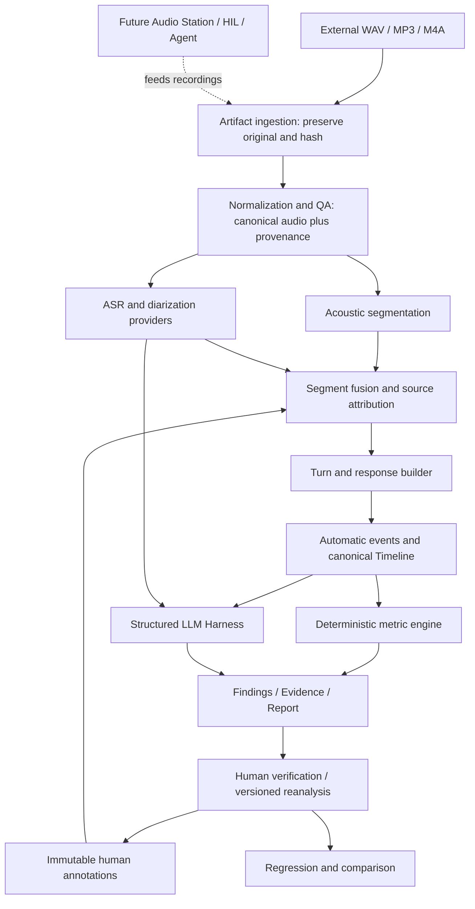

# System Architecture — Recording Import and Automatic Analysis

> M1 实现更新：本分支统一 ImportRun、ASR 路由、调用审计和转写；恢复/契约与当前验证限制见 [Recording Backbone](23-recording-backbone.md)。下文旧版本路径和可用状态以该技术更新为准。

> Technical reference / 技术参考。产品范围、验收与当前代码实现标识统一见 [PRD](PRD.md)。设计目标或示例不表示功能已实现；历史执行状态不替代当前 ref 审计。

The primary Docker/Web UI product is an evaluation harness for externally recorded tester + AI terminal conversations. Recording may be performed by a phone, recorder or computer; tester speech can be spontaneous, driven by frozen audio or by a future agent. The import pipeline does not require a sound card, a live device or a TestCase. Existing HIL and Case infrastructure remains available as a later input path.

## Processor boundaries

Every processor consumes artifact/revision references and an explicit versioned configuration, and emits immutable outputs plus a stage record. The orchestrator owns scheduling, failure isolation and dependency eligibility. It does not contain signal algorithms or semantic rule forests. The initial implementation uses local files and a CLI/internal API; a Docker backend and browser frontend are the delivery target. No distributed Control Plane, database cluster or remote Station is required.

| Processor | Input → output | Responsibility |
| --- | --- | --- |
| Artifact ingestion | file → OriginalArtifact, hash, import Run | copy without overwriting, size/format preflight |
| Audio processing provider | original → canonical WAV, metadata, derivation record | decode/resample/downmix, preserve original timing and parameters |
| Audio QA | canonical → measurements/warnings | duration, sample count, peak, RMS, DC, clipping; no invented acceptance limits |
| Acoustic segmentation | waveform → boundary/interval candidates | signal-based timing, confidence and uncertainty; silence/noise/cue distinctions |
| ASR provider | audio → raw response + Transcript | estimated text/word timing, never device-internal ASR |
| Diarization/source attribution | waveform/reference/model outputs → speaker clusters/roles | tester/device/unknown, provenance and alternatives; first speaker is not automatically tester |
| Segment fusion | acoustic + ASR + diarization + annotations → evidence-bearing segments | keep disagreements and uncertainty; never clone mix into isolated tracks |
| Turn/response builder | segments + semantic decisions → associations | chronological candidates, interruption continuation/new intent, unresolved associations |
| Event detector | segments/associations → EventTimeline | speech/response/interruption start/end, silence, overlap, timeout, possible false endpoint |
| Deterministic engine | eligible events → MetricResult | calculations, denominator, thresholds and uncertainty |
| LLM Harness | bounded evidence context → schema-constrained decisions | intent, effective answer selection, semantic quality and candidate findings |
| Finding/report | validated metrics/decisions → Findings and JSON/Markdown | evidence references, confidence, review state, audio navigation |
| Revision manager | corrections → append-only Annotation + new AnalysisRevision | retain original machine output and reproducible effective views |

## Run and artifact identity

A Run snapshots Device, Hardware, Firmware, AI Model, Prompt Version, Supplier, Environment and Notes. Unknown labels remain null. A scripted TestCase is optional; unscripted imports use a versioned evaluation profile, not fabricated test audio or expected answers. OriginalArtifact has its own hash/container/metadata and never gets overwritten. NormalizedAudio references its parent original plus the exact converter/tool version and conversion parameters. Preserve native channels and compressed source; mono is a working derivative, not proof of isolated sources.

Analysis revisions preserve Run ID, original hash, input artifact IDs, processor/config fingerprint, invocation IDs and annotation IDs. Re-running with a new model or manual corrections creates a new revision. Distinguish identical imported file content from identical model output: hosted models may change or be nondeterministic. All outputs are local by default; private recordings and personal reports are ignored by Git.

Every stage records pending/running/complete/partial/insufficient_evidence/failed as appropriate. Processor failure leaves previous artifacts intact and produces a stage failure record. Downstream unavailable outputs use explicit envelopes, not malformed canonical objects or invented empty successes. A basic report is always attempted and shows gaps; a report file alone does not certify the full analysis succeeded.

## Timing and source contracts

The source recording is the imported session clock, starting at the decoder's first retained audio sample. Preserve original presentation start time and conversion mapping. Codec delay/edit lists/resampling/downmix can affect alignment: record what the decoder handled and expose residual uncertainty rather than claiming original sample-level equivalence. Canonical sample-to-time mapping is exact inside its own waveform; audible onset and role are estimates.

Each boundary carries time basis, source, method, confidence, uncertainty and evidence. Acoustic, ASR estimated, diarization, semantic selection and manually corrected timing are distinct. LLMs select existing segment/word/boundary references; they cannot author acoustic timestamps. Manual corrections add a new evidence/annotation layer. Mixed-channel overlap often needs diarization/separation evidence and may remain unknown. A possible false endpoint is a candidate until intended continuation is supported. A timeout requires a configured expectation and a complete observation window; file end alone is not device timeout.

## Deterministic Engine plus LLM Harness

Deterministic code owns hashes, media I/O, metadata, signal measurements, arithmetic, CER/WER when a legitimate reference exists, interval unions, percentiles, thresholds and validation. LLMProvider, ASRProvider, TTSProvider, AudioProcessingProvider and DiarizationProvider share versioned invocation records: provider/model/API/config/prompt version/timestamp/input-output refs/latency/status. Credentials belong in environment, local secret configuration or OS store, never profiles or Git.

The Harness follows Context → Model → Structured Decision → allowed deterministic tool → Observation → Model → validated result. Calls are bounded and decisions schema-constrained. JudgeResult retains decision/score/confidence/reason/evidence_refs/turn_refs/model/prompt_version. Decision retains selected_action/confidence/rationale/required_tools/expected_evidence. Validate tool allowlists and reference existence before execution. Record raw model output separately from validated output. Insufficient or low-confidence semantics stays needs_review. Candidate findings cannot claim internal VAD/ASR/LLM/TTS delays or proven root causes; suspected layers need attribution confidence and log verification.

## Docker/Web UI delivery and later extensions

Home/Runs → Import → Analyze → Analysis with waveform, speaker segments, transcript, turns, events, metrics and findings. Clicking a finding navigates to its evidence time range. Human edits are explicit revisions. Docker services and the Web UI must be tested from a Windows browser with real 5–20 minute recordings and configured providers. No native Windows executable/installer is required. Version/supplier Compare, Golden replay, multi-turn/exploratory agents follow. Audio Station, loopback, automatic physical HIL and remote Station remain P3 extensions with existing code preserved.
