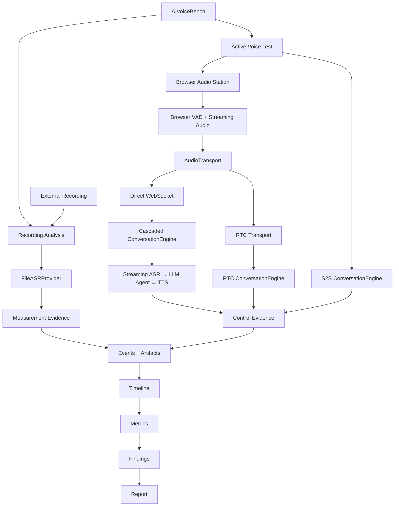

# AIVoiceBench 总体架构

> 本文约束 AIVoiceBench 的长期技术形态；产品范围、优先级、验收条件和实现状态以 [PRD](PRD.md) 为准，执行顺序见 [Roadmap](04-development-roadmap.md)。目标设计不等于已实现。
>
> 2026-09-12 状态说明：main `3877b3d` 已具备 Docker/Web、浏览器播放与采音、RMS VAD、WebSocket 控制、Turn ID、超时和迟到事件防护；PR #66 已接通 AudioWorklet 连续 PCM、Direct WebSocket 音频流、StreamingASRProvider、Partial/Final Transcript 与自由模式最小闭环，并通过软件、容器和受控输入浏览器验证。真实火山云、真实扬声器/麦克风和实体设备仍未验收；Streaming TTS 仍是目标能力。

## 1. 项目定位

AIVoiceBench 是面向 **AI 语音终端、AI 玩具和语音智能体**的测试与评测 Harness，而不是普通语音聊天产品。

项目的核心目标不是单纯获得更流畅的语音对话，而是建立一套：

> **可观测、可复现、可比较、可解释、可回归的 AI Voice Test Harness。**

系统需要能够回答：

- 设备什么时候开始说话、什么时候结束；
- ASR、LLM、TTS 各阶段发生了什么；
- 多轮对话为什么进入下一轮；
- Barge-in、False Endpoint、异常恢复等行为如何发生；
- 最终测试结论对应哪些原始 Evidence；
- 不同语音技术栈之间的性能和行为差异。

架构优先级为：

> **测试透明性 > 可观测性 > 可替换性 > 实时体验优化。**

## 2. 当前基础架构

| 层 | 当前方案 |
| --- | --- |
| 使用环境 | Windows 浏览器 |
| 部署方式 | Docker Linux Container |
| Backend | Python 3.12 + FastAPI + Uvicorn |
| Frontend | HTML / CSS / Vanilla JavaScript |
| 音频处理 | Browser Audio API + FFmpeg |
| 浏览器采音 | `getUserMedia` + `AudioWorklet` 连续 PCM；`MediaRecorder` 仅作显式 `turn_file` fallback |
| 当前 VAD | Browser RMS VAD |
| 控制通信 | WebSocket |
| Recording ASR | File ASR Provider |
| Active Voice ASR | `StreamingASRProvider`；已有火山流式适配器，真实云待验收 |
| LLM | Provider / Model 配置体系 |
| 数据持久化 | Run Artifact + 本地 Volume |
| 正式分析链 | Recording → Evidence → Events → Metrics → Findings |

当前 Docker 采用单服务和本地持久卷模式，没有引入 PostgreSQL、Redis 等额外基础设施，符合单机测试 Harness 阶段。

Active Voice Test 已具备浏览器音频播放、麦克风连续采集、本地 VAD、控制/音频双 WebSocket、Turn ID、Timeout、Late Event 防护，以及 Streaming ASR 驱动的自由模式最小闭环。当前结论只到 software/container/browser_verified；没有真实云和实体设备证据时，不得描述为完整实时语音验收。

## 3. 两条一级工作流

AIVoiceBench 长期保持两条性质不同、相互关联的主链路。

### 3.1 Recording Analysis

用于正式测试录音分析：

```text
External Recording
        ↓
Normalize / Acoustic Analysis
        ↓
File ASR
        ↓
Diarization / Turn Attribution
        ↓
Event Detection
        ↓
Timeline
        ↓
Metrics
        ↓
Semantic Evaluation
        ↓
Findings / Report
```

这一链产生 **Measurement Evidence**，用于正式量化设备性能，例如响应时延、打断表现、端点判断和异常行为。

Recording Analysis 使用 `FileASRProvider`，例如 `VolcengineFileASRProvider`、`VoskProvider` 或其他离线 ASR Provider。录音文件发布、Signed URL、对象存储等机制只属于 File ASR 场景，不应成为实时语音测试的基础依赖。

### 3.2 Active Voice Test

用于 AIVoiceBench 主动与被测 AI 设备进行语音交互：

```text
AIVoiceBench TTS
        ↓
Computer Speaker
        ↓
AI Device
        ↓
Device Speaker
        ↓
Computer Microphone
        ↓
AIVoiceBench
```

这一链产生 **Control Evidence**，主要用于：

- 驱动测试；
- 判断测试轮次；
- 理解设备回答；
- 决定下一测试动作；
- 保存完整执行 Trace。

Control Evidence 可以辅助分析，但不能直接替代外部录音形成的 Measurement Evidence。执行完成也不表示设备通过正式测试。

## 4. Active Voice Test 目标架构

Free Voice Test 曾使用以下过渡链路：

```text
一轮录音
→ 上传音频
→ File ASR
→ LLM
```

PR #66 已在受控软件与浏览器范围内接通以下 Reference / Instrumented Pipeline：

```text
Browser Microphone
        ↓
AudioWorklet / Continuous Capture
        ↓
PCM Audio Chunks
        ↓
Direct WebSocket Transport
        ↓
FastAPI Backend
        ↓
StreamingASRProvider
        ↓
Partial / Final Transcript
        ↓
Observation
        ↓
LLM Test Agent
        ↓
Decision
        ↓
TTS（当前整段 WAV；Streaming TTS 为目标）
        ↓
Browser Playback
```

这条 Reference Pipeline 的价值不是宣称它比 RTC 更适合生产，而是每个关键步骤都由 AIVoiceBench 显式控制和记录，适合作为透明、可审计的测试基准链路。

## 5. ASR 架构

ASR 明确分成两类生命周期能力：

```text
ASR
│
├── FileASRProvider
│      ├── VolcengineFileASRProvider
│      ├── VoskProvider
│      └── Other File Provider
│
└── StreamingASRProvider
       ├── VolcengineStreamingASRProvider
       └── Future Streaming Provider
```

### 5.1 File ASR

服务于 Recording Analysis：

```text
完整文件输入
→ 完整 Transcript
→ 时间戳
→ 后处理
```

### 5.2 Streaming ASR

服务于 Active Voice Test，生命周期为：

```text
open session
→ push audio
→ partial
→ final
→ endpoint
→ close
```

Streaming ASR 的输出属于 Control Observation，不自动视为正式 Measurement Evidence。File 与 Streaming Provider 可以共享配置、Transcript 片段结构和调用审计，但不能共用一个假定相同生命周期的接口。

## 6. VAD 与 Streaming ASR

引入 Streaming ASR 后仍保留 Browser VAD，近期采用：

```text
Browser VAD
+
Streaming ASR
```

并行观察。

Browser VAD 主要负责：

- `speech_suspected_start`；
- `speech_suspected_end`；
- timeout 和本地采音健康状态。

Streaming ASR 主要负责：

- partial transcript；
- final transcript；
- semantic observation；
- provider endpoint information。

每个 Observation 至少记录 `source`、`timestamp`、`confidence` 和 `basis`。不同来源发生冲突时保留冲突，不静默覆盖。这是分析 False Endpoint、Barge-in、远场识别和异常恢复的必要条件。

## 7. Fixed Mode 与 Free Mode

### 7.1 Fixed Voice Test

Fixed Mode 是确定性测试 Runner：

```text
Test Case
→ TTS / Frozen Audio
→ Playback
→ Device Response
→ VAD
→ Next Action
```

基础 Fixed Mode 不强制依赖 Streaming ASR：

```text
ASR unavailable ≠ Fixed Test unavailable
```

需要语义判断的 Test Case 可以显式声明 ASR Observation 依赖；缺少依赖时必须拒绝或弃权，不能伪造结果。

### 7.2 Free Voice Test

Free Mode 是 Agent 驱动的测试模式：

```text
TTS
→ Device
→ VAD + Streaming ASR
→ Observation
→ LLM Decision
→ Next Test Action
```

Free Mode 必须理解设备回答，因此 Streaming ASR 是正式目标链路。当前“一轮捕获完成后再调用 File ASR”的方式只作为过渡或 fallback，不作为长期目标架构。

## 8. 统一 Observation 与 Event Model

AIVoiceBench 应建立跨 Recording Analysis 与 Active Voice Test 的统一 Event Schema。核心事件包括：

```text
playback_requested
playback_started
playback_ended

listening_started
speech_started
speech_ended

asr_session_started
asr_partial
asr_final
asr_error

agent_observation
agent_decision

tts_requested
tts_ready

barge_in
interrupted

timeout
cancelled
error
```

Event 至少包含：

```text
session_id
run_id
turn_id
timestamp
source
event_type
payload
provenance
```

当前控制记录与 Recording Timeline 的字段和枚举仍需收敛。新增统一 schema 时应版本化并提供旧 Artifact 兼容读取，不能直接重命名历史事件而破坏回放。

最终由同一条可追溯链形成结果：

```text
Events
→ Timeline
→ Metrics
→ Findings
```

## 9. 可替换的传输与对话引擎

音频传输层目标抽象为：

```text
AudioTransport
│
├── DirectWebSocketTransport
└── RTCTransport
```

对话执行层目标抽象为：

```text
ConversationEngine
│
├── CascadedConversationEngine
│      ASR → LLM → TTS
│
├── RTCConversationEngine
│      Managed RTC / AI Bot
│
└── S2SConversationEngine
       Speech-to-Speech
```

当前已经形成 `DirectWebSocketTransport + StreamingASRProvider + CascadedConversationEngine` 的最小 Reference Pipeline；下一步是完成真实云与实体设备验收、统一 Event Trace，并补齐 Barge-in 等控制能力。Provider 与 Harness、Transport 与 Conversation Engine 之间都通过版本化契约隔离。

## 10. RTC 的定位

AIVoiceBench 不把火山 RTC 或其他 RTC 平台作为唯一底层语音架构。RTC 适合作为未来的可选执行引擎。

生产级语音 Agent 通常受益于 RTC 提供的 AEC、ANS、AGC、Jitter Buffer、弱网处理、实时打断和 Endpoint Detection。但 AIVoiceBench 是测试平台：如果所有实时控制都交给 RTC 黑盒，平台可能无法区分设备真实行为与 RTC 处理后的行为，尤其会影响 False Endpoint、AEC、Barge-in、Speech Start 和 Speech End 等测试。

> **RTC 是被比较和被验证的执行方案之一，而不是测试 Harness 唯一的真值来源。**

## 11. S2S 的定位

未来 AIVoiceBench 应支持在同一套 TestCase、Observation、Event Schema、Metrics 和 Report 下比较：

```text
ASR → LLM → TTS
vs
S2S
vs
RTC Managed AI
vs
Hybrid
```

S2S 更适合作为测试对象或可选 Conversation Engine。Reference Test Agent 第一阶段采用三段式架构，因为 ASR、LLM、TTS 各阶段可以独立测量和审计。

## 12. Evidence、时间与运行身份

- Original Artifact 不覆盖；派生音频保存父引用、Hash、工具版本和转换参数。
- Execution Run 保存测试刺激、计划动作、实际动作和 Control Observation；Analysis Run 保存外部录音及 Measurement Evidence。二者通过可追溯引用和带不确定性的时间映射关联。
- 播放命令时间不等于真实声学 onset；不同设备时钟不能未经校准直接相减。
- 声学、VAD、ASR、diarization、语义和人工修订各自保留来源、置信度和不确定性。
- LLM 只能选择已有证据引用，不能创建声学时间戳、内部时延或确定性根因。
- 重分析生成新 Analysis Revision；人工修订不覆盖机器原件。
- 单阶段失败保留已有 Artifact 和失败记录，下游明确标记 skipped、partial、insufficient_evidence 或 failed。

## 13. 当前暂不引入的基础设施

当前阶段不急于增加：

```text
React
PostgreSQL
Redis
MinIO
Prometheus
Grafana
Loki
Kubernetes
```

原因不是这些技术没有价值，而是 AIVoiceBench 目前仍然主要是单机、Docker、Windows Browser、本地设备测试和 Artifact-based Run。当前更重要的是完成测试链正确性，而不是提前建设 SaaS 基础设施。

当出现多人协作、远程 Station、大规模并行测试、中央 Dashboard 或本地 Artifact 已无法满足查询/并发/恢复需求时，再通过明确的容量和运维证据引入数据库、缓存、对象存储及集中可观测设施。

## 14. 前端演进原则

当前 Vanilla JavaScript 不立即重写。短期优先完成：

```text
真实云 Streaming ASR 验收
真实 Windows 音频与实体设备验收
Barge-in 与异常恢复
统一 Event Trace
```

当 UI 状态复杂度明显增加，例如出现 Run Dashboard、Waveform、Timeline、Compare、Regression、Device Matrix 和 Remote Station，再评估迁移到 `React + TypeScript + Vite`。前端框架升级不应阻塞核心测试能力建设。

## 15. 最终目标架构



## 16. 当前开发优先级

当前阶段集中完成：

```text
已完成（软件/受控浏览器）：File / Streaming ASR 分离
        ↓
已完成（软件/受控浏览器）：AudioWorklet + Direct WebSocket + 火山适配器
        ↓
已完成（最小闭环）：Mic → ASR → Observation → Agent → TTS
        ↓
下一步：统一 Event Schema / Execution Trace
        ↓
下一步：真实云 ASR + Windows 音频 + 实体设备验收
```

Reference Pipeline 成熟以后，再增加 RTCConversationEngine、S2SConversationEngine 和 Hybrid Engine。录音分析 M1 的证据闭环和真实录音验收可与上述实时基础链并行推进，但两条链各自的完成门槛不能互相替代。

## 17. 核心架构原则

> **Harness 层不能与某一个 Provider 绑定。**

> **Control Evidence 与 Measurement Evidence 必须分离。**

> **File ASR 与 Streaming ASR 是两种不同生命周期能力。**

> **RTC 是可选执行引擎，不是唯一底座。**

> **S2S 是可比较的 Conversation Engine，而不是默认黑盒。**

> **Event Schema 是不同执行方式之间的统一接口。**

> **先建立透明、可测量的 Reference Pipeline，再增加生产级优化 Pipeline。**

AIVoiceBench 最终要建立的不是“最好的语音 Agent”，而是：

> **能够客观测试不同语音 Agent、不同设备和不同语音技术路线的通用 Benchmark Harness。**
