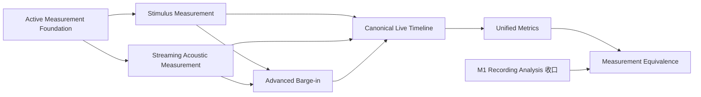

# Development Roadmap — 双正式 Measurement Pipeline

> 产品范围、优先级和验收条件的唯一来源是 [PRD](PRD.md)；总体技术边界见 [架构文档](01-system-architecture.md)。本文只说明实施顺序、依赖和阶段出口，不把目标设计写成已实现。

## 1. 路线选择

AIVoiceBench 同时推进两条一级正式测量链：

- **Recording Analysis 收口线**：继续完成 M1 的 Judge、Findings、人工修订、完整报告和真实录音验收。
- **Active Measurement 演进线**：在现有 Active Voice Control Plane 旁建立持续 Measurement Audio、sample clock、在线声学事件、Canonical Timeline 与正式 MetricResult。

两条线不共享 Audio Evidence；它们共享 Canonical Event 语义、指标定义、MetricResult 契约和尽可能一致的 Measurement Policy。Event Producer 可不同，Metric Producer 必须保持唯一。External Recording 可做独立复测和 Measurement Equivalence，不是 Active Result 转正前置。

## 2. 当前基线（main `0362b22`）

| 范围 | 当前事实 | 明确缺口 |
| --- | --- | --- |
| Recording Analysis | 导入、标准化、云 File ASR、聚类/归属、融合，以及有角色证据时的 Turn/Event/Metric 主链已有 | Judge/Findings 未接入 ImportRun；人工修订、完整报告和真实录音验收未闭环 |
| Fixed Voice Test | 浏览器播放、麦克风、Control RMS VAD、WebSocket 控制、Turn ID、超时、停止和迟到事件防护已有 | Frozen Golden Voice、Measurement Audio、条件 Barge-in、设备选择和实体设备验收未闭环 |
| Free Voice Test | AudioWorklet 在设备回答阶段把 PCM 送入 Streaming ASR；partial/final、Agent 下一轮和显式 File ASR fallback 已有 | 不是跨整次 Run 的 durable Measurement Audio；真实云/设备、预算、Coverage、Barge-in 与 Streaming TTS 未完成 |
| Canonical metrics | `compute_timeline_metrics(...)` 输出 MetricResult 3.0.0 | 只由 Recording Timeline 调用；Active Measurement 尚无 Canonical Timeline，不得另建平行公式 |
| Measurement Equivalence | 产品/方法概念已定义 | 没有真实配对实验；保持 validation_pending |

## 3. Active Measurement 连续里程碑

| 阶段 | 当前状态 | 关键交付 | PRD refs | 阶段出口 |
| --- | --- | --- | --- | --- |
| A — Active Measurement Foundation | ⬜ 下一实现阶段 | continuous browser PCM、durable `ART-live-measurement-audio`、sample-indexed timebase、capture integrity、Evidence/provenance、Execution Run 引用 | F023/F025、N002/N003/N007 | WAV/container/hash/sample count 一致；连续/重复/缺口/stale/stop/cancel/断连/非法格式均有测试；不影响 Fixed/Free 控制 |
| B — Stimulus Measurement | ⬜ planned | 保存 stimulus reference/identity/sample info；Measurement Audio alignment；tester speech start/end | F019/F020/F025、M002/M004 | tester boundary 来自声学 alignment 而非 playback callback；弱/多重匹配弃权 |
| C — Streaming Acoustic Measurement | ⬜ planned | `AcousticBoundaryPolicy`；rolling noise、hysteresis、min speech/silence、merge gap、uncertainty；Streaming Segmenter 与 Batch replay | F025、N007 | 在线 device onset/offset 可 provisional→finalized；现有 global-noise Batch 算法保留独立版本且不伪称等价 |
| D — Canonical Live Timeline | ⬜ planned | Active Measurement → EventTimeline；Evidence refs；Turn/Response identity；unknown/abstain | F008/F025 | Canonical event taxonomy 与 Recording 一致；`execution-record.json` 仍独立保留 |
| E — Unified Metrics | ⬜ planned | Active Timeline → `compute_timeline_metrics(...)`；live provisional display；finalized MetricResult；run aggregation | F009/F025、M001–M010 | 相同 canonical fixture 不论 pipeline 均得相同数值；无 `live_*`/`offline_*` 指标 |
| F — Measurement Equivalence | ⬜ validation_pending | 同一物理交互的独立 External Recording；paired bias/error/agreement；批准阈值 | F024/F026、N007 | Mean Bias、Median AE、P95 AE、Bland-Altman、边界/timeout/barge-in agreement 有真实实验；通过前不得写 verified |
| G — Advanced Overlap / Barge-in | ⬜ planned | stimulus reference/loopback、reference cancellation/AEC/source-aware processing、overlap identity | F020/F025、M005/M006/M007/M009 | 单麦克风 Energy VAD 不再被误写为已解决；证据不足继续 insufficient_evidence |

## 4. 与既有产品里程碑的映射

- **M1 Recording Analysis** 继续收口，不因 Active Measurement 插入硬件前置。
- **M2 Fixed Voice Test** 承载 A、B、C 的普通 turn-taking 最小闭环；F025 Foundation 是本任务第一实现阶段。
- **M3 Free Voice Test Agent** 复用相同 Measurement Plane，并完成 D、E 的实时展示/最终化；Fixed 控制推进仍不依赖 Streaming ASR。
- **M4 关联与验证** 完成 F；外部录音关联服务于复测/方法验证，不承担 Active Result 转正。
- **M5 Compare / Regression** 只比较兼容 case/asset/metric/policy 版本；G 可在证据与硬件条件成熟后进入。

## 5. 阶段门禁

每个阶段分别记录：

1. **Contract verified**：schema、身份、sample timebase、完整性、错误与兼容行为有针对性测试。
2. **Software verified**：受控 PCM/fixture 下的状态机、处理器、失败隔离和审计通过。
3. **Browser verified**：Windows 浏览器真实权限、持续音频生命周期、停止/断连和多轮操作通过。
4. **Container verified**：Docker 运行、持久卷、重启读取和 API 下载通过。
5. **Physical-device verified**：真实扬声器、麦克风和实体设备完成执行；记录环境和失败。
6. **Measurement-equivalence verified**：独立双录音配对、误差/偏差/一致性达到批准策略。

前一层通过不自动升级后一层。发布镜像、合成音频、Provider mock、浏览器播放成功或 Execution Run 完成都不能替代真实设备或 Measurement Equivalence。

## 6. 兼容性与非目标

- Recording Analysis、File ASR/Streaming ASR 生命周期、Fixed 无 ASR 基础控制、Free Mic→Streaming ASR→Agent、stop 行为和 provider call accounting 必须回归。
- `execution-record.json` 保留 Control Trace 价值；新 Measurement artifacts 通过引用并存，历史 artifacts/schema 尽量可读。
- 第一阶段可以只保存 Stimulus Reference/interface，不输出伪造 tester acoustic boundary。
- RTC、S2S、Hybrid、React 重写、数据库/集群、专业 SPL/Remote Station 不进入本次基础切片关键路径。
