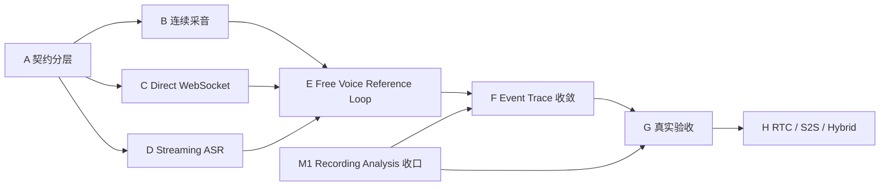

# Development Roadmap — Reference Pipeline 演进路线

> 产品范围、优先级和验收条件的唯一来源是 [PRD](PRD.md)；总体技术边界见 [架构文档](01-system-architecture.md)。本文只说明实施顺序、依赖和阶段出口，不重复定义产品需求，也不把目标设计写成已实现。

## 1. 路线选择

AIVoiceBench 同时推进两条工作流，但共享 Evidence、Event、Timeline 和 Provider 治理：

- **Recording Analysis 收口线**：继续完成 M1 的 Judge、Findings、人工修订、完整报告和真实录音验收。
- **Active Voice Reference Pipeline 线**：PR #66 已在软件与受控输入浏览器范围接通“连续采音 → Direct WebSocket → Streaming ASR → Observation → Agent → TTS”；下一步完成真实云、真实 Windows 音频、实体设备与完整执行约束验收。

两条线可以并行推进；实现进展和验收门槛分别记录。Active Voice 的 Control Evidence 不能替代 Recording Analysis 的 Measurement Evidence，M1 未完成也不能被实时链路发布覆盖。

## 2. 当前基线

| 范围 | 当前事实 | 明确缺口 |
| --- | --- | --- |
| Recording Analysis | 导入、标准化、云 File ASR、聚类/归属、融合，以及有角色证据时的 Turn/Event/Metric 主链已有 | Judge/Findings 尚未接入 ImportRun；人工修订、完整报告和真实录音验收未闭环 |
| Fixed Voice Test | 浏览器播放、麦克风、RMS VAD、WebSocket 控制、Turn ID、超时、停止和迟到事件防护已有 | Frozen Golden Voice、条件 Barge-in、设备选择和实体设备验收未闭环 |
| Free Voice Test | main `3877b3d` 已接通 AudioWorklet、二进制音频 WebSocket、StreamingASRProvider、partial/final、Agent 下一轮和显式 File ASR fallback | 真实云/真实设备未验收；预算、Coverage、Barge-in 与 Streaming TTS 未完成 |
| 统一事件 | Recording Timeline 与 Active Voice execution record 均有基础 | 字段、事件名、时间基准和兼容策略尚未收敛为统一版本化 schema |

## 3. 实施阶段

| 阶段 | 状态 | 目标与关键交付 | PRD refs | Issue / 工作单元 | 阶段出口 |
| --- | --- | --- | --- | --- | --- |
| A — 契约分层 | ✅ 软件完成 | 明确 `FileASRProvider` / `StreamingASRProvider` 生命周期；定义 AudioTransport、Observation、ConversationEngine 边界；设计统一 Event Schema 及旧 Artifact 兼容策略 | PRD-F004/F005/F016/F021、N002/N003 | #7/#22/#30、PR #66 | Provider 边界已落地；统一 Event Schema 仍在 F 阶段收敛 |
| B — 浏览器连续采音 | 🟡 受控浏览器完成 | 用 AudioWorklet 持续获取标准 PCM chunk；保留 Browser VAD；记录采样配置、丢帧、权限、中断、噪声基线和本地时间基准 | PRD-F014/F021/F023 | PR #66；#6 普通音频范围 | 受控输入已验证；真实 Windows 音频、标签页挂起与设备矩阵仍待验收 |
| C — Direct WebSocket Transport | ✅ 软件/受控浏览器完成 | 在现有控制 WebSocket 之上明确音频帧、控制帧、背压、顺序、Turn/Session 身份、取消和重连边界 | PRD-F004/F020/F021/F023、N005 | #5、PR #66 | 音频与控制消息可关联；重复、迟到、跨轮数据被拒绝或留痕；File ASR fallback 显式标注 |
| D — Streaming ASR | 🟡 适配器完成 | 实现 `VolcengineStreamingASRProvider`，支持 open/push/partial/final/endpoint/close 和脱敏调用审计；Provider 失败不破坏 Run | PRD-F005/F016/F021、N003/N004 | PR #66；真实云验收工作单元待建 | 受控协议验证完成；真实云鉴权、判停、延迟与配额行为仍待实测 |
| E — Free Voice Reference Loop | 🟡 最小闭环完成 | 接通 Mic → VAD + Streaming ASR → Observation → LLM Decision → TTS/Playback；执行预算、停止条件、Tool allowlist 和设备输入隔离 | PRD-F014/F016/F021/F023 | #5/#9、PR #66 | 受控浏览器多轮已通过；真实设备、预算/Coverage、Barge-in 与 Streaming TTS 未完成 |
| F — Event Trace 收敛 | ⬜ 待推进 | Active Voice 与 Recording Analysis 采用共同 Event envelope；从 Events 形成 Timeline/Metric/Finding；Execution Run 与 Analysis Run 先手动关联 | PRD-F004/F008/F009/F011/F017/F024、N002 | #2/#3/#4/#8/#24/#26/#27；F024 Issue 待建 | 旧数据可读；控制/测量来源不混淆；报告可从正式结论追到外部录音，再关联执行动作 |
| G — 真实验收 | ⬜ 未开始 | 使用 Windows 浏览器、真实云 ASR、电脑扬声器/麦克风、实体 AI 设备和独立外部录音完成验收 | PRD-F005/F016/F020/F021/F023/F024、N005 | #5/#6/#7/#22/#27 及上述新增 Issue | 软件、浏览器、实体设备执行、外部录音正式测量四类证据分别记录；失败场景和未覆盖场景不隐藏 |
| H — 可选引擎 | ⏸ 后置 | 在 Reference Pipeline 稳定后增加 RTC、S2S 和 Hybrid Conversation Engine，并使用同一 TestCase/Event/Metric/Report 比较 | PRD-F018/F022 及届时批准的新增需求 | #6 专业范围；新引擎逐项建 Issue | 可切换而不改 Harness 核心；每种引擎暴露能力/黑盒边界；不兼容条件拒绝直接比较 |

## 4. 并行关系与依赖

- B、C、D 在契约冻结后可并行，但不得分别发明不兼容的时间、Turn 或错误模型。
- M1 的 Judge/Findings/修订/报告可以与 B～E 并行；F 和 G 需要两条证据链都能正确区分来源。
- Fixed Mode 继续依赖确定性 Controller 和 VAD，不因 Streaming ASR 不可用而整体失效；语义型 Case 可以显式依赖 ASR。
- RTC/S2S 不插入 Reference Pipeline 成熟前的关键路径。

## 5. 阶段门禁

每个阶段都必须分别记录：

1. **Contract verified**：schema、身份、时间基准、错误与兼容行为有针对性测试。
2. **Software verified**：受控输入下的状态机、Provider、失败隔离和审计通过。
3. **Browser verified**：Windows 浏览器真实权限、音频生命周期、停止/断连和多轮操作通过。
4. **Physical-device verified**：真实扬声器、麦克风和实体设备完成执行；记录环境和失败。
5. **Measurement verified**：独立外部录音进入 Recording Analysis，正式结论回溯 Measurement Evidence。

前一层通过不自动升级后一层。发布镜像、合成音频、Provider mock、浏览器播放成功或 Execution Run 完成，都不能替代实体设备和正式测量验收。

## 6. 暂不进入关键路径

以下工作需要由实际规模或产品需求触发，不应阻塞当前 Reference Pipeline：

- React / TypeScript / Vite 全量重写；
- PostgreSQL、Redis、MinIO；
- Prometheus、Grafana、Loki；
- Kubernetes、复杂云端 Control Plane；
- 专业声卡同步、SPL 校准和 Remote Station；
- RTC、S2S、Hybrid Engine。

当出现多人协作、远程 Station、大规模并行测试、中央 Dashboard 或现有本地 Artifact 模型无法满足恢复和查询时，再建立单独 PRD 变更与迁移路线。
