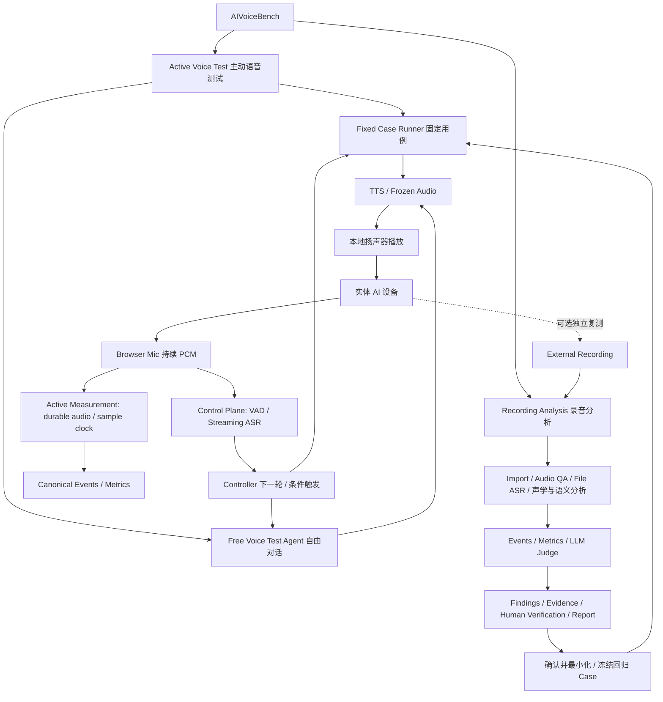

# AIVoiceBench 产品需求文档（PRD）

**产品唯一需求入口。** 本文归集已明确的用户要求，不因当前代码缺少功能而降低验收要求。需求由项目所有者审阅修改；架构、Issue、工作日志不能自行改变本文的产品范围。直接的新用户指令优先，开发者应在同一 PR 中同步本文并说明差异，不能把自己的推断写成用户批准。

## 1. 如何审阅与识别实现状态

每项功能有稳定 `PRD-Fxxx` 编号，指标有 `PRD-Mxxx`，非功能要求有 `PRD-Nxxx`。编号不随排序变化，也不复用已废弃编号。每项记录需求、可核对的验收条件、代码状态、验证状态和实现依据。**需求内容是目标；状态是截至本次审计的事实。**

| 标识 | 代码状态含义 |
| --- | --- |
| ✅ `implemented` 已实现 | 所标明的有限功能范围已有代码与针对性验证；不等于整个产品完成真实录音验收 |
| 🟡 `partial` 部分实现 | 有基础或局部能力，但该需求尚有未闭环的必要条件 |
| ⬜ `planned` 待实现 | 审计基线未发现可交付实现；设计、配置占位和关闭 Issue 均不算实现 |
| ⏸ `deferred` 暂缓 | 非当前 MVP 优先项；保留现有代码，需后续排期 |

验证标识独立记录：`software_verified` 软件/合成数据验证、`container_verified` 镜像验证、`browser_verified` 浏览器操作验证、`real_recording_pending` 真实录音待验收。未给定真实录音与有效服务凭据，**本 PRD 不含任何 real_recording_verified 项**。测试数量不能替代功能覆盖率，不发布“完成百分比”。

### 需求、实现建议与实现状态

三者分开记录，不得互相升级：

- **需求**（本文第 3～6 节）：产品需要什么、用户可操作能力是什么、如何验收。只有项目所有者能修改。
- **实现建议**（第 9 节索引的架构/技术文档、schema、Issue）：如何实现。具体函数名、字段名、拆分方式、调用次数、Provider 复用方式都属于实现选择，可以由开发者在技术文档中演进，**不能自动成为 PRD 没有提出的产品门槛**。典型误用：把“必须调用两次服务”当成产品要求（复用一次 ASR 原生输出即可满足同一需求）；把某个具体字段名当成验收条件。
- **实现状态**：截至某次审计或某个分支的事实，必须给出代码入口、测试和 commit/PR/tag 依据。

本文中的代码状态最初以 **main `c612d36` / `v0.2.0-alpha.2`** 为审计基线（2026-09-11），随后按 **main `8d01ef2` / `v0.3.2`** 复核，并在 2026-09-12 刷新到 **main `3877b3d`**，其后按 **main `dc0bcae`** 复核，最后按 **main `c020d8dd`（PR #70 合并提交 = `v0.4.0-alpha.3` 发布基线）** 校准。未合并分支单独标注，不能写成 main 已实现；发布和软件验证也不能替代真实验收。历史条目与固定到旧提交的代码/测试引用按当时基线保留，便于复核。

### 代码位于哪里

- [main 审计源码](https://github.com/lybym/AIVoiceBench/tree/c612d36a61a5cbc90f629677b28d64228316f1d0) 与 `v0.2.0-alpha.2` 指向同一提交（**审计时点的历史基线**；main 其后已推进到 `8d01ef2` = `v0.3.2`）。PR #48/#49/#50/#53/#55/#56 已合并；#51/#52 虽显示 Closed，其实现提交已由集成历史带入 main，不能根据 PR 标签判断代码缺失。
- [v0.3.2](https://github.com/lybym/AIVoiceBench/releases/tag/v0.3.2) 仍为正式发布（GitHub Latest）；**当前预发布版为 [`v0.4.0-alpha.6`](releases/0.4.0-alpha.6.md)**（会话停止后不再把迟到转写显示为设备确认回答 + `max_turns` 完整轮次语义与严格整数契约；**由尚未合并的候选分支 PR #75 构建**，tag 指向该分支的发布候选 commit 而不是 main，Pre-release、不接管 Latest）；[`v0.4.0-alpha.5`](releases/0.4.0-alpha.5.md)（同一候选分支的上一版）、[`v0.4.0-alpha.4`](releases/0.4.0-alpha.4.md)（由收敛后的 main 构建）、[`v0.4.0-alpha.3`](releases/0.4.0-alpha.3.md) 与更早的 [`v0.4.0-alpha.2`](releases/0.4.0-alpha.2.md) 保留原标签、说明与附件。
- [CI 34511317063](https://github.com/lybym/AIVoiceBench/actions/runs/34511317063) 在 Windows/Linux 各运行 445 项测试，Linux 跳过 1 项，工作流成功；[发布工作流 34511317171](https://github.com/lybym/AIVoiceBench/actions/runs/34511317171) 成功，含镜像启动、合成三格式导入、重启恢复、附件重新加载验证。本次文档审计复核这些记录，未重新运行硬件或真实云测试。
- [PR #54](https://github.com/lybym/AIVoiceBench/pull/54) 的可选语义角色归属尚未合并；main 的聚类标签不等于 tester/device 角色，正常无角色输入仍保持 unknown。
- 真实云凭据调用、5～20 分钟真实设备录音与人工标注质量验收仍待完成。完整 M1 未通过；预览版不是产品完成声明。

## 2. 产品定义与边界

AIVoiceBench 是可复现、可追溯、可比较、可回归的 **AI Voice Terminal Evaluation Harness**，服务于 AI 玩具、陪伴终端、音箱等具备麦克风与扬声器的语音设备。

主要使用者：测试工程师分析对话和缺陷；产品负责人审阅体验与验收证据；算法/软件工程师定位退化；采购或供应商评估人员在可比条件下对照版本与设备。供应商比较是后续扩展，不挤占导入分析 MVP。

### 两条一级主流程（Primary Workflows）

**Active Voice Test（主动语音测试）与 Recording Analysis（录音分析）均为一级核心能力。** Import First 表示开发顺序：先完成 M1 录音分析，再完成 M2 固定用例主动测试、M3 自由测试 Agent；不能把平台定位缩减为上传录音后的分析工具。



**主动语音测试：** 用户选择固定 Case，或指定 Goal、Test Strategy、Coverage、Budget 和 Stop Condition；平台主动向实体设备发问，通过实时观察控制下一轮，生成 Execution Run。固定模式冻结用例、音频、停顿和触发策略，由确定性 Controller 执行；自由模式由受 Harness 约束的 LLM Test Agent 根据观察生成下一步动作。两种 Runner 共享播放、观察和执行审计基础。

**录音分析：** External Recording → Import → Normalize / Audio QA → Acoustic Segmentation + ASR / Diarization → Source Attribution / Segment Fusion → Turn / Response Association → Automatic Events / Event Timeline → Deterministic Metrics → Structured LLM Evaluation → Findings / Evidence → Human Verification → Report → Regression。

输入通常是手机、录音笔或另一台电脑录下的**单轨混音**，同时包含测试者（人或平台播放）与 AI 设备。独立导入仍只需录音及可选设备资料，不要求先创建 TestCase、Execution Run、Timeline 或指定全部说话人。

### 双正式 Measurement Pipeline

AIVoiceBench 有两条相互独立、同等正式的测量路径：

1. **Active Measurement**：平台播放测试刺激，并通过本地 Measurement Capture 持续采集现场声学信号；在线/增量 Event Producer 产生可暂定、可最终化或弃权的 Canonical Events。
2. **Recording Analysis**：手机、录音笔或另一台电脑产生 External Recording；离线 Event Producer 从该录音形成 Canonical Events。

两条路径的声学原件必须独立：`ART-live-measurement-audio` 不等于 `ART-external-recording`。它们可以来自不同麦克风、具有不同时间基准和有限测量偏差，不要求逐 sample 一致或指标逐毫秒相同；但必须使用一致的指标定义、Canonical Event 语义、MetricResult 契约和版本化 Measurement Policy。**Event Producer 可以不同，Canonical Metric Producer 应唯一。**

```text
Active Measurement                         Recording Analysis
Browser Mic → Live Measurement Audio       External Recording
             → Online Event Producer       → Offline Event Producer
                         \                 /
                          Canonical EventTimeline
                                   ↓
                         Canonical Metric Engine
                                   ↓
                              MetricResult
```

External Recording 是独立复测、深度离线分析、问题审计、人工复核、算法回归和 Measurement Equivalence 验证手段；它不是 Active Measurement 获得正式资格的必经步骤，也不是实时测试的唯一正式真值来源。

### Control Plane 与 Measurement Plane 分离

浏览器麦克风的同一 PCM 输入可以被两个 Plane 消费，但证据契约不同：

| Plane / 证据 | 来源和用途 | 产品边界 |
| --- | --- | --- |
| Control Plane / Control Evidence | 快速 Browser VAD、Streaming ASR、播放日志、Agent Observation/Action；负责播放、下一轮、stop/continue、timeout guard 和 UI | 允许低延迟近似；不能因共享 PCM 就自动升级为 Measurement Event |
| Active Measurement Plane / Measurement Evidence | 持久化 Live Measurement Audio、sample clock、Measurement-grade acoustic processor、Canonical Events | 满足 Measurement Policy、完整性和 Evidence Contract 后，可独立产出正式结果 |
| Recording Analysis / Measurement Evidence | 独立 External Recording、离线声学/语义处理和人工复核 | 形成另一份独立正式结果，不为 Active 结果“转正” |

播放命令、`playback_ended`、WebSocket 接收时间、`performance.now()` 和 ASR provider timestamp 均可用于控制或传输诊断，但不能单独充当正式声学边界。Active Measurement 的正式边界优先绑定 `sample_index / sample_rate` 得到的 `audio_relative_ms`。执行完成仍不代表设备通过测试；Measurement Evidence 不充分时输出 `insufficient_evidence` 或 `invalid`，不得把控制观察改名为正式测量。

### ASR 路线分叉：File ASR 与 Streaming ASR

两条一级主流程使用**生命周期完全不同**的 ASR 能力。不能再用一个"只接受文件"的 Provider 模糊表达两者，也不能让 Free Voice Test 以"先录完整 WAV → 上传 → 文件识别"作为正式主路径。

| | Recording Analysis | Active Voice Test |
| --- | --- | --- |
| 输入 | 已完成的完整录音 | 浏览器麦克风的持续音频流 |
| Provider 家族 | **FileASRProvider** | **StreamingASRProvider** |
| 当前实现 | `VolcengineASRProvider`（录音文件识别；按服务要求经 Signed URL 音频发布） | `VolcengineStreamingASRProvider` 已实现并通过受控验证；真实火山云调用待验收 |
| 输出 | 完整 Transcript（utterances / timestamps / 说话人标签） | partial / final transcript + speech / endpoint 观察 |
| 生命周期 | 一次提交、一次识别、可离线重跑 | open session → push audio chunk → partial → final → close / cancel |
| ASR 输出角色 | Measurement Pipeline 的文字/语义证据之一；provider timestamp 仍不是声学真值 | Control Plane 的文字/语义观察；可被 Active Measurement 引用为语义证据，但 provider timestamp 不得充当正式声学边界 |

- 两条链共享模型配置思想（provider / model / resource / 后端托管凭据 / 版本化调用审计）与"凭据不进浏览器、不进 Git、不进快照"的原则，**但不要求共用同一种 Provider 接口**。
- Signed URL / 对象存储音频发布属于 Recording Analysis 的 File ASR 路线；**不得成为 Active Voice Test 的必需条件**。
- 长期凭据只由 Backend 持有。浏览器只上传音频流，**不持有 AppID / Access Token / API Key / Secret / 长期 Credential**。若供应商提供短时客户端凭据机制，须先核对官方文档与安全边界后另行设计。
- Streaming ASR 的 timestamp / confidence 不自动升级为正式声学边界。Active Measurement 的正式 speech boundary 优先来自 Live Measurement Audio processor；ASR 主要提供文字和语义证据。
- 详细边界与技术契约见 [Streaming ASR 边界](24-streaming-asr.md)。

产品闭环：**指定测试策略 → 平台主动与设备对话并形成 Active Measurement Result → 可选的独立 External Recording 复测/深度分析 → 发现与复核问题 → 沉淀固定回归 Case → 下一版本重新自动测试。**

### 交付边界

交付形态为 **Docker 后端 + 前端、Windows 浏览器访问 Web UI**。M1 不以现场播放和监听为验收前提；M2 必须支持普通电脑扬声器播放与麦克风实时观察（PRD-F023），不能因专业 HIL 延期而整体排除真实本地音频能力。浏览器音频或本地适配器的具体方案由技术设计确定，不假设 Docker 自动获得 Windows 音频设备。

Windows EXE/安装包、集群、复杂云端 Control Plane 不属于当前交付前提；专业声卡同步、loopback、SPL 校准和 Remote Station 继续作为 P3 扩展（PRD-F022）。既有 Audio Station/HIL、Runner、Vosk、契约和确定性引擎保留并按需扩展。

### 能力分类（非全部已实现声明）

保持原有五层评测视角：L1 声学/语音（wake word、VAD/endpoint、ASR、AEC、TTS、远场/噪声）；L2 实时交互（turn-taking、节奏、打断、TTS cancel、连续对话）；L3 AI 认知（intent、context、memory、instructions、knowledge/reasoning、工具使用）；L4 Persona/UX/Safety（自然度、情感、主动性、儿童安全、隐私、医疗与内容安全）；L5 可靠性（网络、重连、恢复、耐久、性能漂移）。能力 ID、指标 ID 和 Case ID 独立，通过引用关联。分类不意味着每一项都有检测器或属于当前 MVP 的已实现功能；实现范围逐项以下文为准，技术映射见 [测试方法](02-test-methodology.md)。

### 不可违反的产品原则

1. Evidence First：结论可回溯到 Run → Turn → Event → 音频区间 → Transcript/Evidence → 处理器/模型版本。缺失证据输出 insufficient_evidence、low_confidence 或 needs_review，不猜时间、得分或内部根因。
2. 不把 ASR/diarization/LLM 估计边界写成精确声学真值；不按先后顺序强行分配 tester/device；混音不能伪装成独立声道。
3. 文件、Hash、音频元数据、信号时间、公式、CER/WER、统计和验证由确定性代码执行；语义决策由有约束、有证据的模型节点执行。
4. 原始文件、机器输出和人工修订分层保存；不得以“人工修正”为由覆盖机器原件。
5. 云 ASR/TTS/音频服务可优先选用，Vosk 保留离线 fallback。实现云接口前核对官方文档，不把历史 endpoint/resource/model/voice/API version 固化为产品要求。
6. Control Evidence、Active Measurement Evidence 与 External Recording Evidence 分层保存；保留计划动作、实际动作和观测差异，不以执行成功替代正式测量通过，也不让两条正式 Pipeline 共享同一声学原件。
7. 无设备日志不能宣称已测得内部 VAD/ASR/LLM/TTS 延迟；外部 ASR 不是设备内部 ASR；黑盒回声行为不是 ERLE。疑似层只能带置信度和 requires_log_verification。

## 3. 需求总览

| ID | 功能 | 优先级 | 代码状态 | 集成位置 / 当前主要缺口 |
| --- | --- | --- | --- | --- |
| PRD-F001 | WAV/MP3/M4A 导入与设备资料 | P0 | ✅ implemented | main + alpha.2；Web/CLI 均用统一导入路径 |
| PRD-F002 | 原始与派生 Evidence/provenance | P0 | ✅ implemented | main + release；此状态限定导入资产 |
| PRD-F003 | 标准化与 Audio QA | P0 | ✅ implemented | main + release；准确率不由 QA 保证 |
| PRD-F004 | 全链路可恢复编排 | P0 | 🟡 partial | ImportRun 已贯通 acoustic→聚类/归属→fusion→turns→timeline→metrics；Judge/Findings 仅状态占位 |
| PRD-F005 | 时间戳 ASR 与云服务（Recording Analysis / File ASR） | P0 | 🟡 partial | 云 File ASR/原生响应/时间戳与调用审计已接通；真实云及录音质量待验收 |
| PRD-F006 | 混音说话人/声源归属 | P0 | 🟡 partial | ASR-native 聚类、声源归属与可选语义角色提议已接入；机器提议一律待复核，真实角色识别仍未验收 |
| PRD-F007 | Turn / Response 关联 | P0 | 🟡 partial | 有角色证据时可生成 turns/responses；自动语义关联仍未闭环 |
| PRD-F008 | 自动事件与规范 Timeline | P0 | 🟡 partial | 已接入统一账本及身份引用；显式角色路径有契约测试，真实自动事件待验收 |
| PRD-F009 | 确定性指标集成 | P0 | 🟡 partial | 已产出 MetricResult 3.0.0，方向/候选语义修复已入 main；自动语义及真实对照未完成 |
| PRD-F010 | Structured LLM Harness / Judge | P1（MVP 必需） | 🟡 partial | 既有独立 pipeline/Provider 可用；ImportRun 尚不执行 Judge，完整工具循环未闭环 |
| PRD-F011 | Findings 与问题解释 | P1（MVP 必需） | 🟡 partial | 既有候选生成模块保留；ImportRun 尚不执行 Findings，确认工作流未完成 |
| PRD-F012 | 人工修正与有效视图 | P1（MVP 必需） | 🟡 partial | RevisionStore 已有；Web 修订/重算未接通 |
| PRD-F013 | Markdown + JSON 报告 | P1（MVP 必需） | 🟡 partial | 导入状态报告按 AnalysisRevision 保存；完整结论报告尚未接入主导入流程 |
| PRD-F014 | Web 测试与分析工作台 | P0/P1 | 🟡 partial | main + release；转写、聚类、阶段状态、ASR 重试与回放已有；波形、完整 Timeline、人工审核仍缺 |
| PRD-F015 | 统一模型配置管理 | P1 | ✅ implemented | main + release；配置/路由/快照已有，ASR 与 ASR-native 聚类可绑定；Judge 配置不等于导入流程已执行 |
| PRD-F016 | 语音服务实际调用（File ASR / Streaming ASR / TTS） | P0 File ASR（M1）/ P1 Streaming ASR + TTS（M2/M3） | 🟡 partial | File ASR/聚类/TTS 已实现并有调用审计；**Streaming ASR 骨架（提供商边界、火山适配器、事件模型、审计）已实现并有软件/浏览器验证，真实云调用未进行**；真实标签契约、真实录音 / 真实云 streaming / 真实设备验收均待完成 |
| PRD-F017 | 同一录音分析修订与重现 | P1 | 🟡 partial | main + release；同 Run 显式 ASR 重试会生成新 AnalysisRevision；通用重分析/人工修订重算尚缺 |
| PRD-F018 | 版本/设备/供应商 Compare | P2 | ⬜ planned | 无产品比较工作流 |
| PRD-F019 | Frozen Golden Voice 资产 | P1（M2 核心） | ⬜ planned | 暂停草稿不算可交付能力 |
| PRD-F020 | Active Voice Test Controller / Fixed Runner | P1（M2 核心） | 🟡 partial | Runner 基础已有，真实多轮控制未完成 |
| PRD-F021 | Free / Exploratory Voice Test Agent | P1（M3 核心） | 🟡 partial | 正式链路 Mic → VAD + Streaming ASR → Observation → LLM Decision → TTS → Playback 已在软件、候选镜像内与受控输入浏览器测试中打通（PR #70 已合并，随 `v0.4.0-alpha.3` Pre-release 发布；含启动前能力预检强制、降级显式标注与失败处置、空回答处置）；真实服务、真实设备、预算与 Coverage 未完成 |
| PRD-F022 | 专业 HIL / 同步校准 / Remote Station | P3 | ⏸ deferred | Station 代码保留，非当前 MVP 门槛 |
| PRD-F023 | 基础本地播放与麦克风采集 | P1（M2 核心） | 🟡 partial | 播放、控制 VAD、停止、最小执行记录与 Free 模式设备回答阶段的 Streaming ASR 采集已具备；跨整个 Active Run 的 Measurement Audio 由 F025 承接 |
| PRD-F024 | Execution Run 与独立录音 Analysis Run 关联 | P1（M2 手动 / M4 自动） | ⬜ planned | 用于独立复测/等价性验证的双 Run 引用、时间映射及自动匹配待实现；不再是 Active Result 转正前置条件 |
| PRD-F025 | Active Measurement Pipeline | P1（M2 核心） | ⬜ planned | Live Measurement Audio、sample clock、刺激引用、在线声学事件、Canonical Timeline 与统一 Metric Engine 尚未形成；本轮只收敛 docs，代码后续按 Roadmap 实施 |
| PRD-F026 | Measurement Equivalence Validation | P1（M4 验证） | ⬜ planned | 配对实验、偏差/误差/一致性统计和版本化验收策略待真实设备与独立录音验证 |

### MVP 范围与排程的关系

P0/P1 表示开发先后，不表示可选与必选。当前 MVP 专指 M1 录音分析，包含 PRD-F001～F015、PRD-F016 的云 **File ASR**/diarization 与调用审计部分、PRD-F017；各项以第 4 节限定范围和第 7 节验收为准。PRD-F016 的 TTS 与 **Streaming ASR** 部分及 PRD-F018～F026 不阻塞 M1；其中 F016 TTS/F019/F020/F023/F025 为 M2 必需，**F016 Streaming ASR 与 F021 为 M3 必需**，F024 自动关联与 F026 配对验证属于 M4。优先级与里程碑共同表达排程：主动测试是 P1 核心能力，但不插队 M1；专业 F022 继续 P3。PRD-F015 的配置管理已实现，不代表 PRD-F016 的语音调用已实现。

Recording Analysis 与 Active Voice Test 的 ASR 路线不同：前者用 File ASR，后者用 Streaming ASR。二者的 provider timestamp 都不替代声学边界；Active Measurement 的正式声学边界由 Live Measurement Audio processor 产生，Streaming ASR 继续优先服务控制与语义观察。

同一功能的“代码已实现”“已合入 main”“已发布”“真实录音验收通过”分别记录；本次仅按代码/测试/发布证据刷新实现状态，不升级真实验收状态。

## 4. 核心功能与验收条件

### PRD-F001 — 录音导入与设备资料

**代码：✅ implemented；验证：software_verified、container_verified、browser_verified；位置：main + alpha.2（Web/CLI 统一导入）。**

接收 WAV、MP3、M4A，不依赖 TestCase；支持用户提供的 5～20 分钟完整对话。Device、Hardware Version、Firmware、AI Model、Prompt Version、Supplier、Environment、Notes 可选，未知保持空值。当前实现额外设置 30 分钟 / 1 GiB 上限，这是版本限制，不把真实 20 分钟准确性验收改成短样本验收。

- [x] CLI 与发布版 Web 三种格式可进入导入流程，错误格式明确拒绝。
- [x] 设备资料与 Run 关联，损坏录音仍保留导入 Run。
- [ ] 5～20 分钟真实录音的全链路质量与可用性验收（见第 7 节，不能由本项代码完成替代）。

依据：[import_pipeline.py](https://github.com/lybym/AIVoiceBench/blob/v0.1.3/aivoicebench/import_pipeline.py)、[api.py](https://github.com/lybym/AIVoiceBench/blob/v0.1.3/aivoicebench/api.py)；[test_import.py](https://github.com/lybym/AIVoiceBench/blob/v0.1.3/tests/test_import.py)、[test_web_release.py](https://github.com/lybym/AIVoiceBench/blob/v0.1.3/tests/test_web_release.py)；Issues #21、#42。

### PRD-F002 — 导入资产与溯源

**代码：✅ implemented（限定导入资产）；验证：software_verified、container_verified；位置：main + alpha.2。**

原始文件和标准化文件分开保存，记录 SHA256、大小、元数据、父资产 ID、转换工具/版本、调用参数及审计输出，不覆盖原件。可沿派生关系找到原始录音；失败诊断与成功结果分开。全部分析结论的统一 Evidence 仍属于 PRD-F004/F008/F011。

- [x] 原始与派生文件存在、Hash 可复核、父引用可追踪。
- [x] 禁止修改已登记的不可变资产；保留转换失败信息。

依据：[import_artifacts.py](https://github.com/lybym/AIVoiceBench/blob/v0.1.3/aivoicebench/import_artifacts.py)、[test_import.py](https://github.com/lybym/AIVoiceBench/blob/v0.1.3/tests/test_import.py)；Issue #21。

### PRD-F003 — 标准化与音频 QA

**代码：✅ implemented；验证：software_verified、container_verified；位置：main + alpha.2。**

内部 Canonical Audio 使用 WAV / PCM16 / 16 kHz / mono，保存原始通道与格式。测量 duration、sample count、peak、RMS、DC、clipping 等，不凭空添加合格阈值。转换可能存在 codec delay 等残余不确定性，不宣称原始压缩音频与标准化边界等同于声学真值。

- [x] FFmpeg/FFprobe 版本和参数有记录；Docker 自带工具。
- [x] 三种真实编码格式的合成音频转换通过；空音频/无语音可以明确弃权。

依据：[audio_processing.py](https://github.com/lybym/AIVoiceBench/blob/v0.1.3/aivoicebench/audio_processing.py)、[Dockerfile](https://github.com/lybym/AIVoiceBench/blob/v0.1.3/Dockerfile)、[docker_smoke.py](https://github.com/lybym/AIVoiceBench/blob/v0.1.3/scripts/docker_smoke.py)；Issue #21。

### PRD-F004 — 分阶段编排与失败隔离

**代码：🟡 partial；验证：software_verified（局部）；位置：main + alpha.2。**

每层 input → versioned processor → output，Run 应包含 OriginalArtifact、NormalizedAudio、AudioMetadata、Transcript、Timeline、Metrics、JudgeResults、Findings、Report。每个阶段可 pending、partial、insufficient_evidence、failed；单阶段失败不能破坏 Run。依赖缺失时明确跳过原因，报告仍尝试输出。

- [x] 导入/标准化/可选 ASR 有阶段账本、输出封装与失败保留。
- [ ] Web 后续 acoustic/fusion/metric/Judge/report 全部接入同一阶段账本、规范资产登记和修订身份。
- [ ] Web/CLI 使用一致的完整分析编排，而非两个局部路径。

已合入范围：Web `/api/analyze` 与 CLI `import` 共用 `import_recording()`；声学、聚类、归属、融合及有合格角色时的轮次/事件/指标均进入账本和资产目录，ASR 重试沿用 Run 并新建修订。Judge/Findings 尚未执行，只发布未运行状态，因此上述完整验收项仍未完成。见 [主链测试](../tests/test_recording_backbone.py) 与 [显式角色端到端测试](../tests/test_explicit_attribution_e2e.py)。

依据：[import_pipeline.py](https://github.com/lybym/AIVoiceBench/blob/v0.1.3/aivoicebench/import_pipeline.py)、[pipeline.py](https://github.com/lybym/AIVoiceBench/blob/v0.1.3/aivoicebench/pipeline.py)；Issues #21、#27。

### PRD-F005 — ASR（Recording Analysis / File ASR）

**代码：🟡 partial；验证：software_verified；位置：main + alpha.2。**

使用可替换 Provider 输出原始响应和带时间戳 Transcript，标记 ASR estimated timing；保留中文、混合语言及识别缺口。Vosk 为可选离线方案，优先允许成熟云服务，不要求本地模型成为最终默认。

**本项是 Recording Analysis 的 File ASR 契约**（完整录音、一次识别、可离线重跑，产出 Measurement Evidence）。Active Voice Test 的实时识别属 **Streaming ASR**，生命周期不同（PRD-F016 / F021 / F023），**不共用同一个只接受文件的 Provider 接口**，也不以 Signed URL 音频发布为前置。

- [x] ASRProvider、Vosk、Transcript 与原生输出验证已有。
- [ ] Web 真实录音自动调用中文云 ASR，并把文本/时间证据接入后续语义和事件分析。
- [x] 云调用资源 ID、版本、原生输出与 invocation 审计已在 Web/CLI 导入路径集成（软件验证）；真实服务调用/质量仍待验收。旧 #31/#32 仅选择性复用，不合入过时异步方案。

云适配器实现见 [volcengine_asr.py](../aivoicebench/volcengine_asr.py)、[asr_audit.py](../aivoicebench/asr_audit.py)、[主链测试](../tests/test_recording_backbone.py)。需要 ASR 路由、凭据及签名音频发布配置；仅填写 Key 不足以调用。

依据：[asr.py](https://github.com/lybym/AIVoiceBench/blob/v0.1.3/aivoicebench/asr.py)、[test_asr.py](https://github.com/lybym/AIVoiceBench/blob/v0.1.3/tests/test_asr.py)；Issues #7、#22、#30。

### PRD-F006 — Speaker / Source Attribution

**代码：🟡 partial；验证：software_verified（弃权与结构）；位置：main + alpha.2。**

处理单轨混音的 speech segmentation → speaker clusters → tester/device/unknown。Assignment 含 confidence、source、provider、model、evidence；融合音色参考、diarization、可选语义判断和人工修正，保留冲突。不能只相信一个模型或按轮流出现强制角色。

- [x] 默认未知角色不会生成伪确定的角色时延。
- [ ] 可用 diarization/source Provider 与真实混音角色识别。
- [ ] 人工角色修订作为新 Evidence/Annotation 参与有效结果。

已合入进展（software_verified）：

- **speaker clustering** 已接真实服务原生说话人标签（复用同一次 ASR 调用、不追加识别、不追加计费）；聚类与角色严格分离，无角色证据时角色保持 unknown。
- **语义角色归属（Semantic Attribution）** 已作为独立的角色归属处理器接入 ImportRun → Attribution → Fusion：仅使用既有证据（本次 speaker scope、转写↔说话人关联、时间顺序、可引用片段、已有显式证据与冲突）提出 tester/device/unknown；模型自报置信度按"未经校准的模型自评"记录，不作为准确率，也不参与任何阈值；结果一律 needs_review，显式/人工证据优先且冲突双方都保留；不满足证据或调用/结构/引用失败时保持 unknown 并保留原因，无 Mock 成功回退。它不采用"第一个说话者/提问者=测试者、回答者=设备"等规则，也不把被置疑的转写内容当作指令。
- 因此"真实混音**角色识别**"仍未完成验收：本分支只达到"聚类可用 + 角色机器提议（待复核）"的软件验证级别，**没有**人工确认、没有真实录音对照、没有真实模型调用。故上方两条验收项继续保持未勾选。接口约定（是否需显式开启说话人分离）仍为 `interface_contract_pending`，未发送任何未经核实的请求参数。

验证与限制见 [06-work-log.md](06-work-log.md) 的 "Real diarization slice" 与 "Semantic attribution slice" 条目。证据见 [diarization.py](../aivoicebench/diarization.py)、[semantic_attribution.py](../aivoicebench/semantic_attribution.py)、[ASR 聚类测试](../tests/test_asr_diarization.py)、[语义归属测试](../tests/test_semantic_attribution.py)与[融合测试](../tests/test_fusion_speakers.py)。

依据：[fusion.py](https://github.com/lybym/AIVoiceBench/blob/v0.1.3/aivoicebench/fusion.py)、[test_evidence_guards.py](https://github.com/lybym/AIVoiceBench/blob/v0.1.3/tests/test_evidence_guards.py)；Issues #22、#24、#26。

### PRD-F007 — Turn / Response 关联

**代码：🟡 partial；验证：software_verified（显式归属 fixture）；位置：main + alpha.2。**

把 Speech Segment → Speaker/Source → Turn → Response → Event 关联。打断后能区分旧回答终止、新输入结束、新 Intent 回答，以及是否又回到旧回答。语义关系不确定时保留候选/待复核，不靠纯时间顺序确认 Intent。

- [x] 显式标注角色的输入可构建基础 turns/responses。
- [ ] 自动角色/语义关联、跨轮纠正和反例覆盖完成。

依据：[fusion.py](https://github.com/lybym/AIVoiceBench/blob/v0.1.3/aivoicebench/fusion.py)、[test_fusion.py](https://github.com/lybym/AIVoiceBench/blob/v0.1.3/tests/test_fusion.py)；Issue #24。

### PRD-F008 — Automatic Event Detection / Timeline

**代码：🟡 partial；验证：software_verified；位置：main + alpha.2。**

识别 tester_speech_start/end、device_speech_start/end、silence、overlap、interruption_start/end、response_start/end、timeout、possible_false_endpoint，并映射到版本化规范事件契约。产品事件概念与当前序列化别名可以不同，但映射必须明确，不能静默改义。

边界必须包含 source、confidence、method、evidence、uncertainty，区分 acoustic、ASR estimated、diarization、LLM semantic selection、manual corrected。声学分段不能只依赖 ASR timestamp。Timeout 需要完整观察窗口和策略；录音 EOF 不自动是 timeout；possible_false_endpoint 不是已确认缺陷。

- [x] 能量 VAD 声学片段、时序候选、未知角色弃权。
- [ ] 自动 Timeline 的 Run/Turn/Response/Evidence、音频区间和规范 schema 全部验证通过。
- [ ] 打断结束、timeout 与 false endpoint 语义及事件命名统一，不把候选直接判真。

已合入证据：`_timeline()`/`_metrics()` 绑定实际 Run 身份；[显式归属端到端测试](../tests/test_explicit_attribution_e2e.py) 验证 Timeline、指标及引用。无角色时不产生伪事件。复杂自动关联、真实边界及语义确认仍未通过整体验收。

依据：[acoustic.py](https://github.com/lybym/AIVoiceBench/blob/v0.1.3/aivoicebench/acoustic.py)、[fusion.py](https://github.com/lybym/AIVoiceBench/blob/v0.1.3/aivoicebench/fusion.py)、[validation.py](https://github.com/lybym/AIVoiceBench/blob/v0.1.3/aivoicebench/validation.py)；Issues #2、#23、#24。

### PRD-F009 — 确定性指标

**代码：🟡 partial；验证：software_verified；位置：main + alpha.2。**

复用 TestCase、EventTimeline、MetricResult、公式、验证和旧 deterministic engine。指标需声明事件选择、适用范围、单位、样本/分母、不确定性、缺值和版本化阈值；没有阈值不得自动判通过。具体用户含义见第 5 节，技术公式见 [指标定义](03-metric-definition.md)。

- [x] 旧引擎的证据验证、基本时延/overlap/CER/统计基础存在。
- [x] 导入 metrics.py 直接产出 MetricResult 3.0.0，保留 2.0.0 可读；Turn Gap 方向与负值、旧 response 引用及 False Endpoint 候选语义已修复并有软件验证。
- [ ] 自动角色/语义事件供给、多区间完整性及所有扩展指标真实有效性验收。
- [ ] 真实录音的指标边界与人工标注对照验证。

新增依据：[指标契约测试](../tests/test_metrics_contract.py)、[版本兼容测试](../tests/test_metric_compatibility.py)、[显式归属端到端测试](../tests/test_explicit_attribution_e2e.py)。不能从契约测试通过推导 M001～M010 均能自动测量。

依据：[engine.py](https://github.com/lybym/AIVoiceBench/blob/v0.1.3/aivoicebench/engine.py)、[formulas.py](https://github.com/lybym/AIVoiceBench/blob/v0.1.3/aivoicebench/formulas.py)、[metrics.py](https://github.com/lybym/AIVoiceBench/blob/v0.1.3/aivoicebench/metrics.py)、[test_engine.py](https://github.com/lybym/AIVoiceBench/blob/v0.1.3/tests/test_engine.py)；Issues #3、#8、#25。

### PRD-F010 — Structured LLM Harness / Judge

**代码：🟡 partial；验证：software_verified；位置：main + alpha.2。**

Orchestrator → Context → Model → Structured Decision → 允许的 Tool/Deterministic Function → Observation → Model → Final Result。关键调用使用 schema-constrained 输出与引用校验，保留原生响应和验证结果；不能用自由文本猜 JSON，不能发明时间戳、音频 Evidence 或内部原因。

语义维度至少覆盖 Intent、Turn 关联、Meaningful Response、Context、Memory、Instruction Following、Reasoning/Knowledge、Hallucination、Persona、Emotion、Proactivity、Safety、对话质量与结论解释。JudgeResult 包含 decision、score、confidence、reason、evidence_refs、turn_refs、model、prompt_version；Decision 包含 selected_action、confidence、rationale、required_tools、expected_evidence。疑似根因保留 attribution_confidence 与 requires_log_verification。

- [x] 可配置兼容服务、结构字段校验、失败/无证据弃权，不默认 Mock 成功。
- [ ] 有效 Transcript/Turn/时间锚点进入 Context；模型只选择已有证据。
- [ ] 完整 schema-constrained 调用、受限工具循环、统一调用审计与上述维度的真实覆盖。

主路径限制：`ImportRun` 未调用 Judge；`judge-results.json` 为状态封装，配置 judge 路由不会使导入自动执行语义评估。已有 `pipeline` CLI 是独立模块入口，不能作为 Web 主流程已闭环的证据。

依据：[llm.py](https://github.com/lybym/AIVoiceBench/blob/v0.1.3/aivoicebench/llm.py)、[llm_provider.py](https://github.com/lybym/AIVoiceBench/blob/v0.1.3/aivoicebench/llm_provider.py)、[test_llm.py](https://github.com/lybym/AIVoiceBench/blob/v0.1.3/tests/test_llm.py)；Issues #10、#30。

### PRD-F011 — Findings

**代码：🟡 partial；验证：software_verified；位置：main + alpha.2。**

Finding 显示 Severity、Confidence、Reason、Evidence、Audio Timestamp、Suspected Layer 与 Human Review。确定性异常与 LLM 候选都须通过证据验证，不从缺少发现推导“设备合格”。严重安全/主观问题需要人工复核。

- [x] Finding/Evidence 基础契约、候选生成和基本呈现存在。
- [ ] 每条结论的完整可解析引用与点击证据音频区间、确认/拒绝工作流。

主路径限制：`ImportRun` 未执行 `generate_findings()`，空列表或 pending 状态不代表没有缺陷。

依据：[findings.py](https://github.com/lybym/AIVoiceBench/blob/v0.1.3/aivoicebench/findings.py)、[test_findings.py](https://github.com/lybym/AIVoiceBench/blob/v0.1.3/tests/test_findings.py)；Issues #4、#11。

### PRD-F012 — 人工修订

**代码：🟡 partial；验证：software_verified；位置：main + alpha.2。**

支持 ASR 文本、speaker、事件边界、turn association、finding 确认/拒绝；记录 reviewer、reason、base revision、原值、新值、证据目标。机器原件保留，生成有效视图与新分析修订，形成 Machine → Human Review → Confirmed Evidence → Regression Case。

- [x] RevisionStore 与复制后应用修订的基础实现。
- [ ] 严格修订 schema/引用校验、并发/基线检查、Web 编辑、下游重算和确认闭环。

依据：[revision.py](https://github.com/lybym/AIVoiceBench/blob/v0.1.3/aivoicebench/revision.py)、[test_revision_pipeline.py](https://github.com/lybym/AIVoiceBench/blob/v0.1.3/tests/test_revision_pipeline.py)；Issue #26。

### PRD-F013 — 报告

**代码：🟡 partial；验证：software_verified、browser_verified；位置：main + alpha.2。**

生成 Markdown + JSON，呈现状态、缺口、指标、语义结果、Findings 和 Evidence。关键结论可定位音频区间及处理版本。只有明确版本化评分/门禁策略存在时才显示 Release Gate 或综合分，必须显示样本与分母。

- [x] 导入状态报告、分析报告、Web Markdown 下载；部分结果不是成功验收。
- [ ] 完整结论级证据闭环、有效修订报告、兼容规范输出与真实验收。

当前导入调用 `write_import_report()`，输出 `report_kind=import_stage_status`、空 conclusions 与设备表现 insufficient_evidence；Web 展示其他阶段产物不代表已生成完整结论报告。`render_report()` 保留于独立 CLI/pipeline，尚未纳入统一导入主链。

依据：[report.py](https://github.com/lybym/AIVoiceBench/blob/v0.1.3/aivoicebench/report.py)、[import_report.py](https://github.com/lybym/AIVoiceBench/blob/v0.1.3/aivoicebench/import_report.py)、[test_findings_report.py](https://github.com/lybym/AIVoiceBench/blob/v0.1.3/tests/test_findings_report.py)；Issues #11、#27。

### PRD-F014 — Web 测试与分析工作台

**代码：🟡 partial；验证：browser_verified、container_verified（局部）；位置：main + alpha.2。**

简洁界面，以 Home/Runs、Import、Analysis、Metrics、Findings、模型管理为当前导航；M2 增加与 Recording Analysis 并列的 Active Voice Test 入口，支持固定 Case、音频设备选择、启动/停止和执行轨迹；M3 增加目标、策略、预算和停止条件配置；M4 展示执行与分析关联；Compare 在 M5 增加。Analysis 应联动 Audio Waveform、Speaker Segments、Transcript、Turn Timeline、Events、Metrics、LLM Findings。不能要求用户读开发实现信息才能正常操作。

- [x] 浅色工作台、历史、导入表单、报告状态、音频控件、片段跳转、指标/发现切换。
- [ ] 波形、完整转写/轮次/事件联动、Finding 区间跳转、人工审核入口及真实长录音体验。

- [ ] M2/M3 主动测试入口可操作，清楚区分执行完成、测量待补充与正式结论；后续范围不计入现有 browser_verified。
- [x] 已合入并随 `v0.4.0-alpha.1` 预览发布（software_verified + browser_verified）：固定用例生成会立即显示 aria-live 状态，轮询会话中实际已完成的短句数量和耗时，阻止重复提交；失败后恢复输入。该进度只反映 TTS 资产生成，不表示播放、设备回答或正式测量完成（Issue #62）。

依据：[static/](https://github.com/lybym/AIVoiceBench/tree/v0.1.3/aivoicebench/static)、[api.py](https://github.com/lybym/AIVoiceBench/blob/v0.1.3/aivoicebench/api.py)；Issues #27、#42。

### PRD-F015 — 模型配置管理

**代码：✅ implemented（配置管理与路由，不代表各处理器均执行）；验证：software_verified、container_verified、browser_verified；位置：main + alpha.2。**

参考 DeepSeek Harness 的 provider profile、credential reference、用途绑定与配置修订方式，实现本项目独立配置层。支持 provider/model/endpoint、语音及推理参数、启停、tts/asr/diarization/judge 默认模型、只写入密钥或环境变量引用。保存配置不得等同于连通验证，不自动发起付费探测。

- [x] 新增/编辑/移除、用途约束、乐观配置版本、持久化、密钥不回显；可配置兼容 Judge，但 ImportRun 尚未执行该服务。
- [x] 配置于下一 Run 生效；每个 Web Run 保存脱敏快照和 Hash。
- [x] 未接入 speech adapter 明示 not_integrated，不模拟运行；现有环境配置首次保存前保持兼容。

依据：[model_settings.py](https://github.com/lybym/AIVoiceBench/blob/v0.1.3/aivoicebench/model_settings.py)、[models.js](https://github.com/lybym/AIVoiceBench/blob/v0.1.3/aivoicebench/static/models.js)、[test_model_settings.py](https://github.com/lybym/AIVoiceBench/blob/v0.1.3/tests/test_model_settings.py)；Issue #44。

### PRD-F016 — 语音服务实际调用（File ASR / Streaming ASR / TTS）

**代码：🟡 partial（云 File ASR、ASR-native 聚类、TTS 与 Streaming ASR 代码路径已合入；真实服务与实体设备未验收）；验证：software_verified、container_verified、browser_verified、real_recording_pending、real_cloud_streaming_pending。**

提供**按生命周期区分**的接入点，并核对火山等当前官方 API 后实现真实调用。ASR 必须显式分成两个家族，不能合并为一个只接受文件的接口：

- **FileASRProvider**（Recording Analysis）：完整录音 → 一次识别 → 高质量离线 Transcript。现有 `ASRProvider`（Vosk、`VolcengineASRProvider`）属此家族；Signed URL 音频发布按该服务要求保留在本链。ASR timestamp 是 provider estimate，不是声学边界。
- **StreamingASRProvider**（Active Voice Test / Control Plane 与语义证据）：`start_session → push_audio → events → finish_input → close / cancel`。统一事件至少包含 `asr_session_started`、`speech_started`、`partial_transcript`、`final_transcript`、`speech_ended`、`asr_error`、`asr_session_closed`，并标注来源（`browser_vad` / provider / `combined`）、provider 时间戳（若有）、本地接收时间、confidence（若有）与依据（basis）。其文字可供 Active Measurement 语义判断引用，但 provider speech timestamp 不能取代 Measurement Audio 的声学边界。
- TTSProvider、DiarizationProvider、AudioProcessingProvider 与既有长音频能力保持原职责。

每次调用记录 provider、model、endpoint/API version、config、prompt_version（适用时）、timestamp、输入/输出 refs、latency、status 与失败类别，**不记录 Secret**。Streaming 会话额外记录 stream/session 标识、音频格式（采样率/位深/声道）、chunk 统计、事件来源与结束原因。配置管理不代表调用能力已交付。

- [ ] 云 ASR/diarization 原生输出、重试/失败状态、调用审计与 Web 分析集成。
- [x] Streaming ASR 最小骨架（main PR #66，software_verified + container_verified + browser_verified）：统一事件模型与来源标注、音频 chunk 顺序与迟到/重复/缺口统计、取消/超时/错误作为一等状态、凭据仅在后端、调用审计不落 Secret；端点/资源/鉴权/音频格式/判停参数按官方文档核对，未核对字段不发送。真实服务调用未进行。
- [ ] Streaming ASR 真实服务调用：以**当前官方文档**核对 endpoint / resource ID / 鉴权头 / 音频格式 / 判停参数后方可实现与声明；契约核对已完成（见 [Streaming ASR 边界](24-streaming-asr.md)），**真实云调用与判停实测仍未进行**，保持 real_cloud_pending。

已合入进展（software_verified）：云 File ASR 原生输出、调用审计、Web/CLI 集成与 ASR-native `DiarizationProvider` 已具备；聚类复用同一次云 ASR 原生响应产出聚类，不新增独立服务端点或第二次识别，结果进入 ImportRun 账本与 Web/CLI。**仍未验证**：供应商是否需在请求中显式开启说话人分离（官方参数表无法离线核实），以及任何真实录音/凭据下的原生标签可用性；因此该整体验收项保持未勾选。见 [云适配器](../aivoicebench/volcengine_asr.py)、[聚类处理器](../aivoicebench/diarization.py)、[主链测试](../tests/test_recording_backbone.py)。
- [x] 已合入（software_verified；`v0.3.1` 发布基线）：`volcengine_tts` 使用 API-Key V3 单向 SSE，显式配置当前 resource ID 与 voice ID；SSE 帧只在拼接为有效 WAV 后才生成播放资产。请求/响应协议、无旧鉴权头、失败脱敏审计和配置传递由单元测试覆盖（Issue #60）。
- [ ] TTS 真实调用服务于主动测试（P1/M2）：固定 Runner 执行前生成并冻结音频，运行时重用资产；M3 自由 Agent 可逐轮生成，保存每轮实际播放音频及引用。效果与成本按服务实际支持能力选择。
- [x] 已合入（software_verified；`v0.3.1` 发布基线）：TTS 失败或音频无效时不生成播放资产，并写入不含 Secret 和原始服务错误的失败审计。预算耗尽、冻结资产版本化和 Execution Run/Turn 正式证据关联仍未实现。

依据：[model_settings.py 的路由与适配器实现](https://github.com/lybym/AIVoiceBench/blob/v0.1.3/aivoicebench/model_settings.py)；Issues #22、#30、#9；旧 #31/#32 的调用审计/发布校验已选择性复用，未整体合入。

### PRD-F017 — 重复分析与修订

**代码：🟡 partial；验证：software_verified（Hash/模型快照）；位置：main + alpha.2。**

同一录音可生成独立 AnalysisRevision，保留 Run、原始 Hash、输入引用、处理器/模型/配置版本、调用记录和人工修订 ID。确定性环节应可重现；云模型差异应可解释而非承诺位级一致。

- [x] 文件 Hash、独立导入记录、模型配置快照等基础存在。
- [ ] 同 Run 多次分析入口、输出不覆盖、修订对比和可解释差异报告。

已合入：`POST /api/runs/{run_id}/resume` 显式重试 ASR，校验 canonical 资产、保留旧输出/快照、使用新配置创建 AnalysisRevision，并执行后续证据链。已完成 ASR/report 时不重复调用。此入口不支持对已完成结果任意重分析，也不等于人工修订后重算。见 [恢复实现](../aivoicebench/import_pipeline.py) 与 [恢复测试](../tests/test_recording_backbone.py)。

依据：[import_artifacts.py](https://github.com/lybym/AIVoiceBench/blob/v0.1.3/aivoicebench/import_artifacts.py)、[revision.py](https://github.com/lybym/AIVoiceBench/blob/v0.1.3/aivoicebench/revision.py)；Issues #26、#27。

### PRD-F018 — Compare

**代码：⬜ planned；优先级：P2。** 比较版本 A/B、设备 A/B、供应商 A/B；声明 case/audio/metric/model policy 的可比范围、样本、分母、环境与不兼容项。验收需可比群体选择、差异指标、证据回溯和不兼容拒绝，不能仅并排展示两个分数。依据：发布版 [api.py](https://github.com/lybym/AIVoiceBench/blob/v0.1.3/aivoicebench/api.py) 无 Compare 工作流；Issue #27 的后续范围。

### PRD-F019 — Frozen Golden Voice

**代码：⬜ planned；优先级：P1（M2 核心）。** 固定 Case 可复现执行的基础。TTS 生成后冻结，保存 text/provider/model/voice/speed/pitch/volume/sample_rate/format/生成时间/hash/响应元数据；回归重用 Frozen Audio，不实时重合成。Golden 表示冻结刺激资产，不代表设备回答的事实真值。

- [ ] 生成、QA、版本和缓存可追踪；Case 锁定音频 Hash/版本，参数变化生成新版本，不覆盖原件。
- [ ] 精确停顿采用 TTS(A) + sample-exact silence + TTS(B)，保存片段和静音 sample count；800 ms 是 Case 示例，非统一门槛。文件中精确停顿不代表真实声场没有误差。
- [ ] 同一 Case 重复执行重用相同资产；资产缺失、损坏或 Hash 不符时拒绝执行并保留原因。

依据：Issue #9 暂停草稿未纳入发布代码；既有 TestCase/音频资产契约可复用。本次升级优先级，不升级实现状态。

### PRD-F020 — Active Voice Test Controller / Fixed Case Runner

**代码：🟡 partial；优先级：P1（M2 核心）；验证：software_verified（仅 Runner 基础）。** Controller 是主动测试执行核心。Fixed Case Runner 冻结 TestCase、音频、停顿、触发条件和超时策略，由确定性状态机执行，不依赖 LLM 决策。复现指相同刺激和控制策略，设备回答与实际触发时间允许不同且必须留痕。

- [ ] 验证 Case/Frozen Audio，创建 Execution Run，保存 Case/策略版本、设备资料、配置快照和音频 Hash；提示资产与打断资产分离。
- [ ] 支持多轮播放、等待设备响应开始/结束、条件触发、明确 deadline、取消与失败处理；记录状态迁移、计划动作、实际播放开始/结束/取消、Observation、触发依据及 Run/Turn 引用。
- [ ] 句中停顿用例可播放“我想问一下”+ 800 ms silence +“南京明天天气怎么样”，等待回答结束后问“北京呢”；文本、停顿和等待策略均冻结。
- [ ] Barge-in 用例先请求长故事，检测设备持续发声后等待 Case 指定时长（如 2 秒）再播放“停，换个问题”；记录实际触发及旧/新回答候选，不能用预拼接时间代替实时触发。未观察到响应时按策略 timeout/停止，不伪造打断成功。
- [ ] 相同 Case 与相同观察序列重放时控制决策一致；真实设备测试核对播放/触发轨迹。设备回答结束的控制判断与正式 Barge-in/时延/语义判定分开。
- [ ] 监听中断、低置信度、自身播放误识别或设备断开时按冻结策略等待/停止并记录原因，不无限等待或无记录追加重试；用户可随时停止。
- [x] **Fixed Mode 的轮次推进由 VAD 控制，不要求 ASR 可用**：ASR 不可用 ≠ Fixed Test 不可用。Streaming ASR 接入后只作为增强 Observation（设备回答文本、复杂条件、Barge-in、False Endpoint、语义触发）；需要语义观察才能执行的 Case 必须显式声明该前提，不能默认把基础 VAD Runner 变成 ASR 依赖。

main 进展（PR #65，software_verified + container_verified + browser_verified）：固定对话控制可靠性加固已实现并可软件/浏览器测试复现——停止为本地即时生效（不等待后端确认，取消当前播放，迟到 `ended` 不会恢复监听或推进），轮次以 `turn_id` 校验，重复/迟到/已停止会话的事件只被记 `ignored` 而不重复推进；无回答超时作为独立事件 `observation_timeout` 上报并按会话策略（`pause`/`continue`）暂停或继续，记录为“未观察到回答”而非回答结束；每轮写入最小控制记录（`execution-record.json`，含服务端播放指令与浏览器播放报告、观察及其依据、关闭原因），区分“服务端发出播放”与“浏览器报告播放”，VAD 仅记录疑似回答；音频不可用/播放被拒/播放卡住/连接断开/会话失效均以明确原因退出且可重新开始。控制等待有明确上限但**不构成产品性能 SLA**。上述均为受控输入下的软件与浏览器验证，**真实扬声器、麦克风与实体 AI 设备验收仍未完成**；F023 的边播放边监听（Barge-in）与自由模式的完整多轮验收不在本次范围。

依据：[runner.py](https://github.com/lybym/AIVoiceBench/blob/v0.1.3/aivoicebench/runner.py)、[test_runner.py](https://github.com/lybym/AIVoiceBench/blob/v0.1.3/tests/test_runner.py)；Issue #5。现有 Run 准备不等于真实多轮执行已交付。

### PRD-F021 — Free / Exploratory Voice Test Agent

**代码：🟡 partial（最小实时链路骨架已建立，真实服务与实体设备验收未完成；PR #70 已合并并随 `v0.4.0-alpha.3` Pre-release 发布，范围为 software/container/browser verified 的受控输入）；优先级：P1（M3 核心）。** 面向测试目标的 Voice Test Harness / Test Agent。用户定义 Goal、Test Strategy、Coverage、Budget、Stop Condition 和禁止行为；LLM Planner 根据实时 Observation 决定下一步话术或动作，经 Harness 校验后调用 TTS/播放/观察工具。与 Fixed Runner 分离，复用 F020/F023 执行基础；不同于事后 F010 Judge。

**正式目标链路（Streaming ASR，不是“先录完整 WAV → 上传 → File ASR”）：**

```text
Browser Mic → 持续采集 → PCM chunks → Backend → StreamingASRProvider
→ partial / final transcript + speech / endpoint 观察 → Observation
→ LLM Test Agent Decision → TTS → Playback → 下一轮
```

- [ ] 保存版本化目标、策略、允许 Tool、轮次/时长/调用成本预算和停止条件；动作经过结构校验及预算检查，越界动作执行前拒绝。预算可配置，15 轮是示例而非默认 SLA。
- [x] **`max_turns` 是完整轮次预算，不是提前停止计数**（Issue #74，software_verified）：`max_turns=N` 表示完整执行 N 个平台轮次，每轮为 Question → Playback → Device Observation → Streaming ASR final / 显式失败 → Capture Finalization → Turn Closure。第 N 个设备回答被观察并关闭**之后**，会话才以 `complete(max_turns)` 结束；不再调用 LLM 或 TTS 生成第 N+1 问、不再发出第 N+1 次 `play`、`awaiting_turn_id=null`，最后一轮 Platform Turn 与 Device Turn 均关闭，最终 transcript / capture / provider audit / execution events 全部保留。**禁止用隐藏轮次或 `max_turns=N+1` 规避。** 最后一轮出现 final transcript、`asr_no_final`、no response、Provider failure、用户停止或浏览器断开时，仍按既有策略明确收尾，不挂起会话；`max_turns` 为 1..50 的整数（与页面输入范围一致），在会话创建时校验。
- [ ] 支持“建立临时事实 → 间隔若干轮 → 重问 → 切换话题 → 恢复原话题”等策略，遵守“不告知正在测试、不直接提示正确答案”等用户约束。
- [x] Mic → VAD + Streaming ASR → Observation → LLM Decision → Action → TTS/Playback 循环保留 Trace（main PR #66，software_verified + container_verified + browser_verified）：模型/提示版本沿用既有 Agent 调用记录，观察引用与来源（`browser_vad` / provider / combined）、决策理由、实际音频与停止原因进入执行记录；真实设备未验收。
- [x] **实时性要求**（main PR #66）：不得要求“收到完整 final 才认为设备开始回答”——VAD 先发现讲话、Streaming ASR 随后给文字；partial 只记录/展示/留痕，Agent 生成下一轮只使用 final，不因 partial 波动触发 LLM。
- [x] 设备回答文本进入 conversation history、Agent context 与 execution trace，并标记为 **Control Evidence**；空 transcript 记为“未观察到回答”并按会话策略暂停或继续，**不会**被当作有效回答自动继续。后续可作为 Active Measurement 的语义证据引用，但不得用 provider timestamp 生成正式声学边界。
- [x] 兼容/降级（main PR #66 引入，PR #70 收紧；已随 `v0.4.0-alpha.3` 发布）：整轮录音 + File ASR 作为**显式标注的 fallback**（`capture_mode` / `resolved_capture_mode` / `capture_fallback_reason`），在 UI、play 消息与执行记录中都标注为降级。**PR #70 起不再存在任何自动降级**：`auto` 只解析为 Streaming ASR，缺少 Streaming ASR 时明确拒绝启动；`turn_file` 只有操作者显式选择时才使用。软件、镜像内与受控浏览器验收覆盖。
- [x] **启动前能力预检并由后端强制**（PR #70 已合并、随 `v0.4.0-alpha.3` 发布；software_verified + container_verified + browser_verified，受控输入有限范围）：`GET /api/voice-test/capabilities/{mode}` 返回按模式所需的 TTS / 对话模型 / Streaming ASR / File ASR（及其实际需要的音频发布条件）与浏览器需自行检查的能力；预检**默认不发起付费探测**，响应与日志不含凭据、服务地址或签名 URL。同一检查在 `POST .../start` 与控制 socket 的 `start` 上强制生效：缺少项时拒绝启动、指名缺少项、`provider_calls` 保持全 0（未发起任何 LLM/TTS/ASR 调用），不会先抓麦克风再等待。Fixed Mode 复用已有音频时不要求 ASR 或 LLM，只在需要新合成时要求 TTS。**“配置存在”不等于“服务已连通”**，真实鉴权/网络失败仍在真实调用时记录。
- [x] **降级路径的真实转换、转写提取与失败状态**（PR #70 已合并、随 `v0.4.0-alpha.3` 发布；software_verified + container_verified + browser_verified）：浏览器上传实际录到的容器，后端先校验签名与大小，再用 FFmpeg 解码为 canonical 16 kHz mono PCM16 WAV 并做 canonical QA，然后才调用 File ASR；文本取自归一化 segments。非法媒体、识别失败与空结果分别记录为 `invalid_audio` / `asr_failed`（HTTP 422/502），**不包装成“成功的空 transcript”、不推进下一轮**；转写只来自服务端捕获记录，浏览器自报的 transcript 不被信任。
- [x] **判停判据与轮次控制上限**（PR #70 已合并、随 `v0.4.0-alpha.3` 发布；software_verified + container_verified + browser_verified）：VAD 使用**时域**线性 PCM RMS（修正此前读频域并除以 255 的错误判据），阈值由本机噪声底抬高；残留非零噪声仍能判定回答结束并推进；一旦检测到疑似讲话，无回答超时不再适用，改由轮次上限显式退出（`reason: cannot_confirm_response_end`，关闭原因 `observation_end_unconfirmed`），**不记为回答完成**。这些等待是控制守卫，不构成产品性能 SLA。
- [ ] Coverage 区分计划、已尝试、已观察及待正式测量；ASR 不确定、无 final、模型/工具失败、预算耗尽或用户停止均有明确处置，不能把控制观察或 Agent 自评当作正式通过。（失败类别与停止原因已作为一等状态；Coverage 与预算尚未实现）
- [ ] 设备回复作为被测数据，不能改写 Harness 的目标、工具权限、预算和禁止行为。
- [ ] M3 保存候选问题与完整轨迹供离线分析/复核；M5 基于 Measurement Evidence 和人工确认最小化用例，冻结音频/策略后交给固定 Runner 复测。探索输出不能直接成为 Golden ground truth。

依据：既有路线图探索目标与用户补充；main PR #66 已实现最小实时链路并保留显式 File ASR fallback；PR #70（已合并）把预检门禁、时域判停与降级失败处置收紧为**后端强制**行为并随 `v0.4.0-alpha.3` Pre-release 发布；Issue #74 明确 `max_turns` 为完整轮次预算（已完成，software_verified）；真实云、真实设备、其余预算维度（成本/时长/停止条件）与 Coverage 仍未验收。

### PRD-F022 — 专业 HIL / Station

**代码：⏸ deferred；优先级：P3；保留已有局部实现。** 保留专业声卡播放/录制、同步/校准、loopback、SPL 校准、physical HIL 与 Remote Station 扩展。普通电脑播放与麦克风观察已拆为 PRD-F023，不随本项延期。验收须明确真实硬件、同步不确定性与健康观察窗口，不以软件 fixture 冒充硬件测试。

依据：[station.py](https://github.com/lybym/AIVoiceBench/blob/v0.1.3/aivoicebench/station.py)、[test_station.py](https://github.com/lybym/AIVoiceBench/blob/v0.1.3/tests/test_station.py)；Issue #6。保留原编号及拆分追溯关系。

### PRD-F023 — 基础本地播放与麦克风采集

**代码：🟡 partial（播放、VAD、停止、最小执行记录，以及 Free 模式设备回答阶段的连续采集与 Streaming ASR 传输已合入；整次 Run 的 Measurement Capture 仍属 F025）；优先级：P1（M2 核心）。** 普通 Windows 电脑扬声器播放测试语音，浏览器麦克风持续采集，同时服务 Control Plane 和 Measurement Plane。复用 Station 接口，不依赖专业 HIL/SPL 校准或 Remote Station 才可用。

```text
Browser Mic → continuous PCM capture（AudioWorklet，目标 16 kHz / mono / PCM16）
├→ Control Plane：RMS VAD + Streaming ASR
└→ Measurement Plane：durable Measurement Audio + sample clock
```

- [ ] Web 可选择输入/输出设备、检查可用性、启动/停止；权限拒绝、无设备和音频中断明确显示，失败不生成成功播放记录。
- [x] 连续音频采集用于 Streaming ASR（main PR #66，software_verified + browser_verified）：采样率/位深/声道显式记录；无法获得目标格式时明确失败；chunk 顺序、迟到/重复、背压、停止释放与网络中断有留痕。真实标签页挂起矩阵仍待 G 阶段验收。
- [x] 麦克风音频经后端转发给 ASR（main PR #66，software_verified + browser_verified）：浏览器只连接本机后端，不持有长期云凭据、也不直接向云服务发送音频。
- [ ] 支持边播放边监听以执行 Barge-in；记录自身播放泄漏、噪声与设备响应归属的不确定性，无法可靠区分时按策略弃权/停止。
- [ ] 保存实际播放资产、设备/采样配置、控制与测量时间基准及丢帧/重复/缺口/中断信息；只有满足 F025 Measurement Policy 和 Evidence Contract 的持久化输入才能成为 Active Measurement Evidence。
- [ ] 真实扬声器、麦克风、实体 AI 设备验证多轮等待和条件打断；可同时使用另一台设备独立录音做 Measurement Equivalence，但外部录音不是 Active Result 的资格前置。

main 进展（PR #66，software_verified + container_verified + browser_verified）：浏览器连续采集以 AudioWorklet 实现（混单声道、线性插值重采样到 16 kHz、PCM16 分帧），若浏览器不接受 16 kHz 的 AudioContext 则由 worklet 重采样，并在页面显示实际采集率与"已重采样"；音频经独立二进制通道
`/api/voice-test/sessions/{id}/audio` 发送，帧为 `[4 字节大端序号][PCM16LE]`，带背压保护，乱序/迟到/重复/缺口计数进入执行记录；麦克风权限、设备断开、通道失败、格式不符、标签页挂起（`stopLocal` 释放 worklet/上下文/录制器/通道）均有明确失败类别。**真实扬声器、真实麦克风与实体设备验收仍未完成**；边播放边监听（Barge-in）与设备选择 UI 仍未实现。

依据：本次用户要求从 F022 拆出；既有 Station 软件基础不构成本项已交付证据。Streaming 传输与事件契约见 [Streaming ASR 边界](24-streaming-asr.md)。

### PRD-F024 — Execution Run 与独立录音 Analysis Run 关联

**代码：⬜ planned；优先级：P1（M2 手动关联，M4 自动关联）。** Execution Run 保存刺激、动作、Control Evidence 和 Active Measurement Evidence；外部录音导入形成独立 Analysis Run，AnalysisRevision 不覆盖执行原件。两者引用关联用于复测、审计和等价性验证；独立导入仍不需要执行记录，Active Measurement 也不依赖该关联才能形成正式结果。

- [ ] M2 支持手动将外部录音导入并关联 Execution Run，记录身份、原件 Hash、Case/Turn 引用及关联来源；未关联显示 external_validation_pending，不得把 Active Measurement Result 降级为非正式结果。
- [ ] M4 自动提出匹配并建立可追溯关联：保存匹配依据、置信度、执行片段到录音区间映射、时钟偏移/漂移及不确定性。歧义、录音不完整或无可靠映射时转人工确认，不静默绑定。
- [ ] 更正关联生成新修订并保留历史；重复导入/重试不产生冲突关联；分段录音或一份录音包含多个执行时明确区间范围。
- [ ] 报告分别从两条 Pipeline 的 Finding/Metric 追溯各自音频区间，再关联到 Case/执行动作；不得跨用声学证据，也不把播放命令或未经映射的跨设备时钟当声学真值。

依据：本次用户明确提出双正式 Measurement Pipeline；关联用于独立验证，不承担“转正”职责。

### PRD-F025 — Active Measurement Pipeline

**代码：⬜ planned（本轮仅 docs，不修改实现）；优先级：P1（M2 核心）。** Active Voice Test 必须能够不依赖 External Recording，直接从本地持续采集的 Live Measurement Audio 生成可信、可审计的正式 Measurement Result。

- [ ] 每次 Active Run 从第一句播放前持续采集到 Run 完成/停止，保存不可变 Measurement Audio Artifact：`artifact_id`、`run_id`、source、SHA-256、采样率、声道、编码、sample count、capture start/end、设备元数据、dropped/duplicate/gap/stale frame 计数和 `measurement_policy_version`。
- [ ] 正式声学时间优先来自 `sample_index / sample_rate` 的 `audio_relative_ms`。wall clock、client/server monotonic clock 和 transport receive time 各自记录用途，不能替代 sample clock。
- [ ] 保存 Stimulus Reference（音频、SHA-256、sample 信息、playback identity），并通过 reference-assisted alignment 从 Measurement Audio 产生 `tester_speech_start/end`；`playback_started/ended` 只作控制/对齐先验，不直接冒充声学边界。
- [ ] Measurement-grade Online Event Producer 使用版本化、streaming-compatible `AcousticBoundaryPolicy`，输出边界 confidence/uncertainty；Batch replay 可用同一 policy 验证。现有全局 noise-floor/peak Batch Algorithm 可阶段性保留，但必须有独立版本且不得宣称等价。
- [ ] 已知 Stimulus Reference 优先归属 tester；剩余 speech 只能作为 device candidate。无法可靠区分时保持 unknown / insufficient_evidence，不按先后猜角色。
- [ ] Active Measurement 形成独立 Canonical EventTimeline，并进入现有 `compute_timeline_metrics(...)` 及其演进后的唯一 Canonical Metric Engine；不得创建 live/offline 平行指标或公式。
- [ ] 事件和结果生命周期区分 `provisional`、`finalized`、`insufficient_evidence`、`invalid`。后续 contract 以独立 `finalization_state` 表达 provisional/finalized，不重载现有 MetricResult 的 observed/pass/fail/insufficient_evidence/not_applicable 状态。边界稳定和证据完整后，Active Result 可自行最终化，不依赖 External Recording。
- [ ] 普通 turn-taking（tester end → device start）优先闭环；单麦克风混音下的 overlap/barge-in 若没有 reference cancellation/AEC/loopback 等足够证据，对 PRD-M005/M006/M007/M009 保持 insufficient_evidence。
- [ ] `execution-record.json` 继续作为 Control Trace；Measurement Audio、Canonical Timeline 和 MetricResult 作为独立正式 Artifact 引用，不覆盖或改名替代 execution record。

### PRD-F026 — Measurement Equivalence Validation

**代码：⬜ planned；验证：measurement_equivalence_validation_pending；优先级：P1（M4 验证）。** 使用真实实体设备和同时但独立采集的 External Recording，对 Active Measurement 与 Recording Analysis 做方法等价性验证；两条 Pipeline 不共享声学原件，也不要求结果完全相等。

- [ ] 对相同物理交互建立可审计配对，保留各自音频 Hash、时间映射、policy/processor/version 和不确定性；禁止 sample-by-sample 一致性伪目标。
- [ ] 至少报告 Mean Bias、Median Absolute Error、P95 Absolute Error、Bland-Altman limits of agreement、speech-start/end detection agreement、timeout classification agreement 和 barge-in classification agreement。
- [ ] 第一阶段可使用 `first_speech_latency_ms` 的 provisional engineering target：Median |Δ| ≤ 30 ms、P95 |Δ| ≤ 80 ms、|systematic bias| ≤ 20 ms；这些不是行业标准，也不是已验证门槛，必须经真实实验后确认或修订版本。
- [ ] 只有完成真实配对实验并达到批准的版本化策略，才可标记 `measurement_equivalence_verified`；代码、fixture、浏览器或容器验证不能替代。

## 5. 用户体感指标要求（PRD-F009 的子需求）

下表定义产品含义；技术单位、公式版本、事件别名和验证边界由 [metric-definition](03-metric-definition.md) 维护，不得反向修改本表以迎合当前错误实现。

| ID | 指标与验收含义 | 代码状态 / 明确差距 |
| --- | --- | --- |
| PRD-M001 | Feedback Latency：用户最终结束 → 首次可感知反馈；记录 feedback_type（嗯/好的/thinking cue/提示音等） | 🟡 partial：当前返回 insufficient_evidence；反馈起点及逐 turn 关联未接通，反馈自身时长不是反馈时延 |
| PRD-M002 | First Speech Latency：同一关联轮次用户最终结束 → 首个设备语音 onset；旧 E2E First Audio 名称的兼容语义见下文 | 🟡 partial：导入路径已按 tester end→同轮 device onset 计算；提前发声为 not_applicable；真实自动角色与边界待验证 |
| PRD-M003 | Meaningful Response Latency：用户结束 → 首个承载答案语义的信息点；ASR+LLM 选择既有锚点并记录证据/confidence | 🟡 partial：已有契约/占位，真实语义锚点未实现；不得将“嗯/让我看看”自动等同答案 |
| PRD-M004 | Turn Gap：用户说完 → 设备有效开始下一轮；明确有效起点和负 gap/overlap 处理 | 🟡 partial：main 已使用 tester_speech_end→device_speech_start 并保留负值；MetricResult 3.0.0 有软件验证，真实对照待完成 |
| PRD-M005 | Barge-in Stop Latency：测试者打断开始 → AI 旧 response 停止；必须关联旧 response_id | 🟡 partial：导入计算关联 interrupted_response_id 并查找旧回答结束；复杂自动关联和真实验证仍缺 |
| PRD-M006 | Barge-in New Intent Latency：新的打断语句结束 → 开始回答新 Intent | ⬜ planned：尚无有效自动语义关联链路，不能用任意下一次设备发声代替 |
| PRD-M007 | Barge-in Success：停止旧回答 + 接收新输入 + 回答新 Intent + 不再回到旧回答 | 🟡 partial：停止/新回答基础契约存在，完整组合语义未闭环；缺一项证据均不得自动通过 |
| PRD-M008 | False Endpoint：用户句中停顿时设备错误抢答；结合意图继续证据，possible_false_endpoint 保持候选 | 🟡 partial：main 仅输出 false_endpoint_candidate（policy=candidate_only）；observed 只表示候选存在，不是确认缺陷 |
| PRD-M009 | Overlap Duration / Ratio：区间并集交集及明确分母；后续可区分正常 backchannel/主动打断/意外重叠 | 🟡 partial：算术基础已有，混音双声源与多区间/分母一致性待闭环 |
| PRD-M010 | Timeout、CER/WER、统计：健康窗口+显式 deadline；正确参考文本来源；eligible 样本与分母、P50/P90/P95/P99 | 🟡 partial：旧 engine/formulas 保留 timeout/CER/WER/统计基础；compute_timeline_metrics 尚不自动产出 M010，缺参考/健康窗口不能计算 |

依据集中为 [formulas.py](https://github.com/lybym/AIVoiceBench/blob/v0.1.3/aivoicebench/formulas.py)、[engine.py](https://github.com/lybym/AIVoiceBench/blob/v0.1.3/aivoicebench/engine.py)、[metrics.py](https://github.com/lybym/AIVoiceBench/blob/v0.1.3/aivoicebench/metrics.py)、[test_metrics_expanded.py](https://github.com/lybym/AIVoiceBench/blob/v0.1.3/tests/test_metrics_expanded.py)。主要任务为 #8、#25，语义依赖 #10，事件依赖 #24。这些问题在本次仅文档 PR 中登记，不偷改业务代码。

### 指标边界与判定策略

- **同一物理量只有一套定义。** Active Measurement 与 Recording Analysis 均输出 `feedback_latency_ms`、`first_speech_latency_ms` 等既有名称，并进入同一 Canonical Metric Engine。不得创建 `live_first_speech_latency` / `offline_first_speech_latency` 或复制公式；来源、pipeline、policy、finalization state 和 uncertainty 作为 provenance 表达。
- **实时可正式，但必须有生命周期。** 边界尚未稳定时可显示 provisional 结果；证据完整且 policy 的最终化条件满足后成为 finalized。缺必要声学/语义证据输出 insufficient_evidence，格式/完整性违反 policy 输出 invalid。Recording Analysis 不负责给 Active Result “转正”。
- **Feedback / First Speech / Meaningful Response 分别记录。** 提示音可以是反馈但不是语音；“嗯”可以同时是反馈和首次语音，但不自动成为有效答案。PRD-M002 保留旧 E2E First Audio 指标按设备语音 onset 计算的兼容语义，不静默改成“任意声音”。输出注明 metric ID、公式版本和所选事件，历史值不能混用新口径。
- **Turn Gap 明示有效起点。** PRD-M004 的方向固定为 tester end → device start；策略须说明选择语音起点还是经语义确认的有效回答起点，并引用相应事件。起点未明确时不计算；不同策略不直接聚合比较。可观察的负间隔保留为负值并关联 overlap，不能截成零掩盖抢话；旧 device end → tester start 结果不能沿用本指标名称。
- **打断成功有观察范围。** PRD-M005 的停止时长与 PRD-M007 的成功判定分开。成功需分别给出旧回答停止、新输入被接收、新 Intent 被回答、观察范围内未恢复旧回答的证据；停止期限和后续观察窗口属于版本化策略。外部录音只能证明可观察行为，不能声称已读取设备内部接收状态。窗口不完整或任一必要证据缺失时不得通过；EOF 不能证明“以后不再回到旧回答”。
- **区间与统计不可伪精确。** 每个时延保留两个边界的来源、不确定性和关联身份；阈值落在不确定区间内时需复核。Overlap 对重复区间先去重，明确分母是有效观察时长还是其他声明范围；unknown 声源不能直接计为 tester/device 重叠。汇总同时报告总样本、可计算样本、弃权/失败及排除原因，避免只展示成功样本。

上述约束是验收口径，尚未全部实现。具体停止期限、观察窗口、覆盖率和允许误差未由项目所有者确定，不在此虚构默认数值；评测设备体验的阈值与验证 AIVoiceBench 测量准确性的容差分别保存。

## 6. 非功能需求

| ID | 要求与验收 | 代码状态 / 验证 / 依据 |
| --- | --- | --- |
| PRD-N001 | Docker 后端+前端、Windows 浏览器；版本号与 Release 一致；有启动配置与持久卷；不要求 EXE | ✅ implemented（容器交付基础）；container_verified/browser_verified；[release.yml](https://github.com/lybym/AIVoiceBench/blob/v0.1.3/.github/workflows/release.yml)、[Dockerfile](https://github.com/lybym/AIVoiceBench/blob/v0.1.3/Dockerfile)。长期运行/恢复与真实全流程仍由第 7 节验收 |
| PRD-N002 | 所有结论的证据与不确定性可验证；规范 schema 和 runtime refs/hash 同时验证 | 🟡 partial；旧 contracts/validation/engine 已有，导入自动输出尚未全部遵从；[validation.py](https://github.com/lybym/AIVoiceBench/blob/v0.1.3/aivoicebench/validation.py) |
| PRD-N003 | 调用/配置/处理器版本可追踪，原件不覆盖，重复运行可解释 | 🟡 partial；import/模型快照已实现，ASR invocation 与重试 AnalysisRevision 已有，Judge 审计与通用重分析尚缺；PRD-F004/F016/F017 |
| PRD-N004 | Secret 不进 Git、API 响应、分析快照；私有录音/个人报告不提交；配置存储持久且限制访问 | ✅ implemented（现有单用户本地管理范围）；software_verified；[.gitignore](https://github.com/lybym/AIVoiceBench/blob/v0.1.3/.gitignore)、[model_settings.py](https://github.com/lybym/AIVoiceBench/blob/v0.1.3/aivoicebench/model_settings.py)。本地密钥数据库为明文，不宣称加密或多租户授权；远程暴露须认证代理 |
| PRD-N005 | 5～20 分钟录音可用、依赖错误可诊断、重启恢复不丢历史/配置/原件；资源限制明确 | 🟡 partial；上传上限和持久卷已有，长录音、恢复/中断全流程待验收；不捏造处理时长或准确率 SLA |
| PRD-N006 | 重要模块有针对性测试；合成/真实分开；每逻辑单元 Issue/branch/PR/work log；不得自动 merge | ✅ implemented（治理与测试基础）；[tests](https://github.com/lybym/AIVoiceBench/tree/v0.1.3/tests)、[AGENTS.md](../AGENTS.md)、[work log](06-work-log.md)。AGENTS/PRD 规则已在 main；每次变更仍须执行，不因历史遵守而永久豁免 |
| PRD-N007 | 正式测量必须记录独立声学原件、sample-indexed timebase、Measurement Policy/processor/version、完整性、confidence/uncertainty 与最终化状态；跨 Pipeline 比较须声明兼容性 | ⬜ planned；Recording Analysis 已有部分 artifact/hash/audio_relative_ms 基础，Active Measurement contract 与真实等价性验证尚未完成 |

## 7. M1 录音分析 MVP 验收门槛（当前未通过）

使用项目所有者提供或明确授权的 **5～20 分钟真实测试者+设备混音录音**，保留本地证据，不提交录音/个人报告到 Git。以下全体通过后，才可将当前 MVP 标为完成：

- [ ] 三种格式可导入，原件/标准化/Hash/元数据/转换 provenance 可复核。
- [ ] 时间戳 ASR、tester/device/unknown 自动分段与角色证据可检查，不依赖手工造 Timeline。
- [ ] 自动 Turn/Response/Event Timeline 能表达自然对话及打断场景。
- [ ] 核心时延、抢话、重叠、打断按合格证据计算；缺证据正确弃权。
- [ ] 结构化 LLM 对 Intent/Context 等执行有效语义判断，结论不越过可观察边界。
- [ ] Findings、Markdown 与 JSON 的关键结论可点击/解析到对应音频区间和处理版本。
- [ ] 人工文本/角色/边界/关联/发现修订可保存，不覆盖机器原件，能生成新有效分析。
- [ ] 同一录音重复分析可按 Run/AnalysisRevision 追踪差异及模型/配置变化。
- [ ] Windows 浏览器中的上传→分析→历史→回放→报告→修订全流程可用；Docker 重启后历史/配置/证据仍可访问。
- [ ] 明确记录实际设备、录音、服务、人工标注、失败案例、版本与验收结论；不得用合成 fixture 或“有报告文件”代替。

### 验收执行与证据记录

先保存机器自动分析，再做人工标注/修订；分别评估自动结果与人工修订后的结果，不能用修订后准确性替代自动能力。三格式导入可用同一授权录音的派生编码验证，但应记录转换关系，不能计为三次独立真实对话。

| 验收范围 | 必须记录的证据与判定边界 |
| --- | --- |
| 场景覆盖 | 记录自然问答、反馈/填充语、打断换 Intent、重叠、句中停顿及未响应场景是否实际出现。录音没有出现的场景标为未覆盖；需要补充授权真实片段或继续待验收，不能从“未发现”推导检测通过 |
| 自动识别与时间 | 对照人工复核的文字、角色、事件边界和 Turn/Response 关系，记录识别错误、边界偏差、漏检/误检及人工标注自身不确定性；可计算覆盖率与准确性分开呈现 |
| 语义与 Findings | 对照音频/转写检查 Intent、Context 与有效回答证据，记录候选误报、漏报、弃权及人工确认/拒绝；未被对话触发的语义维度不虚构评分 |
| 弃权与失败 | 证据不足时弃权是正确行为，但全部 unknown、全部 insufficient_evidence、空 Findings 或仅报告生成成功都不能证明 MVP 完成。故障隔离测试通过也不能代替正常录音自动分析验收 |
| 重复分析与恢复 | 使用同一原件记录不同 AnalysisRevision，核对确定性结果与配置/模型变化；重启后检查历史、配置、原件和派生证据可访问，机器原始结果没有被修订覆盖 |
| 验收结论 | 保存需求 ID、Run/修订、音频区间、人工参考、处理器/模型/策略版本、实测值和通过/不通过/待验收理由；缺必要证据不得勾选通过 |

**定量验收策略待确定：** 在正式质量验收前，由项目所有者确认并版本化场景覆盖、最低可计算覆盖率、角色/事件识别质量、边界允许误差及语义复核准则。当前不填写未经确认的数值；缺少对应策略时可以完成实现和采集实测数据，但不能宣称整体质量验收通过。不能看过结果后静默降低门槛。这里验证的是所选真实录音及已覆盖场景，不据单次录音宣称所有设备/供应商普遍适用。

M1 未完成的主要阻塞是 PRD-F004～F013/F017 的自动证据闭环，不是 Windows 打包、硬件播放录制或 TTS 样式。P1 标记代表排程层次，不代表这些验收项可以从 MVP 删除。

### main 的 M1 实现状态（M1.1～M1.5 工程子阶段）

M1.1～M1.5 仅为产品 M1 内部工程拆分；正式产品里程碑仍按第 8 节 M1～M5。预览发布门槛与第 7 节完整质量验收分开，不能用“小范围可用”替代整体 M1 完成。

| 子阶段 | main / alpha.2 已有范围 | 尚缺 |
| --- | --- | --- |
| M1.1 Recording Backbone | Web/CLI 统一 ImportRun；三格式导入、ASR/原生响应/调用审计、修订与显式重试；合成容器恢复已验证 | 真实云服务、真实录音与质量验收 |
| M1.2 聚类与源归属 | ASR-native 聚类、独立 attribution/fusion、可选语义角色提议；音频 Hash 隔离标签，跨聚类拆段与冲突弃权，原生时间/文本来源保留 | 真实标签契约/可用性；人工复核与真实 tester/device 角色验收 |
| M1.3 Turn / Event / Metrics | 有角色证据时进入轮次/事件/MetricResult 3.0.0，显式归属 fixture 验证通过 | 自然混音自动关联、语义锚点、完整扩展指标和真实对照 |
| M1.4 LLM Judge / Findings | 独立模块与旧 pipeline 保留；主导入流程发布未执行状态 | 接入 ImportRun、受约束工具循环、结论级证据闭环 |
| M1.5 修订 / 重分析 / Web 验收 | 转写/聚类/回放/历史/阶段状态/ASR 重试、修订内状态报告 | 人工 Web 修订、通用重分析、波形/完整 Timeline、真实全流程验收 |

独立导入不需要角色映射。当前普通 Web/CLI 没有角色编辑入口；内部显式映射测试只证明具备该证据时的下游路径，不代表用户已可自动得到角色。缺角色时 turns/timeline/metrics 明确弃权，原件/聚类与 Run 保留。即使配置 Judge，当前导入也不执行语义角色或事后 Judge。

实现与验证依据见 [Recording Backbone](23-recording-backbone.md)、[聚类与融合](18-fusion-turns-events.md)、[指标实现](19-expanded-metrics.md)、[CI](https://github.com/lybym/AIVoiceBench/actions/runs/34511317063)。发布版本为 [v0.2.0-alpha.2](releases/0.2.0-alpha.2.md)，不是待发布的 alpha.1；真实验收项仍全部保留。

## 8. 优先级与变更流程

### 正式产品里程碑

以下为目标排程，不是已交付声明。**先完成 M1，Fixed Voice Test Runner 是紧接 M1 的下一个主要里程碑。** M2/M3 都是核心交付，专业 HIL 保持 P3 独立扩展。

| 里程碑 | 范围 / PRD refs | 阶段完成门槛 |
| --- | --- | --- |
| M1 录音导入分析主链 | F001～F015、F016 ASR/diarization、F017 | 完成第 7 节真实录音验收；继续收尾，不因主动测试调整插入硬件前置依赖 |
| M2 Fixed Voice Test + Active Measurement Foundation | F016 TTS、F019、F020、F023、F025、F014 主动测试入口 | 冻结 Case/刺激；Active Run 持久保存 Measurement Audio、sample clock、完整性和 Stimulus Reference；普通 turn-taking 形成 Canonical Timeline 并进入统一指标引擎；真实扬声器/麦克风/AI 设备完成验证。**Fixed 控制推进仍只依赖 VAD，不要求 Streaming ASR 可用。** Barge-in 正式测量可因证据不足保持 pending/insufficient_evidence |
| M3 Free Voice Test Agent + Streaming Measurement | F021、F016 Streaming ASR/F023 实时语音、F025 在线声学事件、F014 Agent 配置 | 真实设备上按目标执行自适应对话；Control Plane 与 Measurement Plane 并行、音频与 Observation/Action Trace 完整，Active Result 可 provisional→finalized；外部录音仍是独立路径，不以 Agent 自评通过 |
| M4 独立关联与 Measurement Equivalence | F024 自动关联、F026、F004/F017 修订溯源 | 自动/人工配对可复核，歧义可转人工；错配、缺段、时钟偏差有记录；完成批准策略下的 bias/error/agreement 分析后才可标记 measurement_equivalence_verified |
| M5 Compare / Regression / 自动探索缺陷 | F018、F021 回归转换、F019/F020 重放、F011/F012 复核 | 经外部录音分析和人工确认的问题可最小化成固定 Case；下一版本自动重测，同一冻结刺激下输出可比结果/差异证据，不兼容条件拒绝直接比较 |

M2/M3 的控制误差、播放时序偏差和触发可靠性须记录实测结果，并在正式验收前确认版本化容差，不虚构数值。各阶段分别记录软件验证、真实设备执行与正式测量验收，不互相替代。

M1 近期顺序（产品 M1 内部工程子阶段 M1.1～M1.5，非产品里程碑）：在已合并 #43/#45 的基线上，M1.1 统一 PRD-F004 编排/审计与 PRD-F005/F016 ASR → M1.2 PRD-F006 说话人聚类与源归属 → M1.3 PRD-F007/F008/F009 事件关联、Timeline 与 PRD-M001～M010 → M1.4 PRD-F010/F011 语义与发现 → M1.5 PRD-F012/F013/F014/F017 审核/修订/报告/Web → 第 7 节真实验收。相互独立的结构/基础工作可以并行，不能再次形成冗长串行 PR 链。完成 M1 后按第 8 节正式进入 M2 Fixed Voice Test Runner。

2026-09-07 Import First 调整继续约束 M1 执行顺序；将 Controller/TTS/普通本地音频整体长期后置的范围由本次用户明确要求与 M2/M3 排程取代。现有 #5/#9/#6 沿用；历史 Issue 标题/标签不覆盖新的优先级。本次按用户要求同步 docs 中的实现说明与路线图；根目录 AGENTS 的旧 Station/P3 表述未改，产品排程以本 PRD 的 F022/F023 拆分为准。

### 变更流程

1. 修改产品行为先定位 Requirement ID。Issue 写 `PRD refs`、本次范围、验收与依赖；现有 Issue 编号沿用，不按状态机械新建重复任务。
2. 产品范围、优先级、行为或验收变化在同一 PR 修改本文，并在下表记录原因和用户决定。明确新增用户要求后可执行，不因历史文档冲突再索取已给出的授权；未被授权的产品取舍不得静默猜测。
3. 实现状态从 planned → partial → implemented 必须提供代码入口、针对性测试和所在 commit/PR/tag；真实验收状态须另有实际证据。仅添加测试、文档或关闭 Issue 不足以升级状态。
4. 架构定义实现约束，schemas/技术指标定义契约，Issue 定义当前工作单元，work log 只记录事实。若它们与 PRD 冲突，指出并修正，不用旧日志覆盖当前需求。
5. 文档、代码和需求同库版本化；发布记录准确 commit/tag。PRD 变更保留 Requirement ID，合并仅在用户明确授权时执行。

| PRD 版本 | 日期 | 变更 | 来源 |
| --- | --- | --- | --- |
| 1.4.0 | 2026-09-13 | **正式测量边界演进**：确立 Active Measurement 与 Recording Analysis 两条独立正式 Measurement Pipeline；新增 PRD-F025 Active Measurement Pipeline、PRD-F026 Measurement Equivalence Validation 和 PRD-N007；F023 扩展为 Control/Measurement 共用持续采集，F024 改为独立复测关联而非 Active Result 转正前置；正式声学时间基于 sample clock，Stimulus Reference/Alignment、streaming-compatible acoustic policy、provisional/finalized 生命周期和单麦克风 Barge-in 弃权边界纳入验收；PRD-M001～M010 名称与公式保持唯一，不创建实时/离线平行指标。实现状态仍以本分支实际代码与测试更新，不把计划写成已实现 | 项目所有者本任务明确授权：Active Voice Test 可独立产生正式 Measurement Result，External Recording 保持另一条独立正式 Pipeline；两者共享 Canonical Measurement Semantics，不共享 Audio Evidence |
| 1.3.6 | 2026-09-13 | **候选分支预发布 `v0.4.0-alpha.6`（无产品需求变更，仅记录发布与证据边界）**：① 修复“会话已停止后网页仍显示迟到转写为设备确认回答”——前端只在当前观察轮更新设备文本行、运行结束/取消/turn 不匹配或服务端标记 stale 的消息一律不写入该行，`stopped`/`failed` 时清空该行（正常 `complete` 保留已确认回答）；后端 capture 仅在“会话在运行且该轮仍在等待观察”时算当前，迟到 Provider 事件**不写入该轮转写、不写入 execution record**，改为有界 stale 诊断 + `stale_transcript`（`ignored=true`，带 session/turn/原因）通知，`capture_result` 增加 `stale`/`stale_reason`；② 沿用 1.3.4 的 `max_turns` 完整轮次语义与 1.3.5 的严格整数契约；③ 证据边界不变（Control Evidence、无 acoustic measurement、失败不伪装成回答、partial 不触发下一轮）；④ 本版仍由**尚未合并**的候选分支 PR #75 构建，以 Pre-release 发布且不接管 Latest；⑤ 真实物理设备、浏览器麦克风声学测量与 Recording Analysis 正式验收**未尝试/未完成**，第 7/8 节真实验收项未勾选、未降级；⑥ 不包含 Secret、真实用户录音或个人报告 | 项目所有者报告 v0.4.0-alpha.5 上“停止后仍显示迟到转写”并要求修复后发布新的测试包 |
| 1.3.5 | 2026-09-13 | **候选分支预发布 `v0.4.0-alpha.5`（无产品需求变更，仅记录发布与证据边界）**：① 背景——PR #73（Streaming ASR `wss://` 端点 + Provider 正常关闭不再误判为 `stream_disconnected`）**已合并到 main**；② 本版由**尚未合并的候选分支** `fix/free-mode-final-turn-observation`（PR #75）构建，tag 指向该分支的发布候选 commit，**不是 main 发布**，以 Pre-release 发布且不接管 Latest；③ 候选分支内容为 PRD-F021 的 `max_turns` 完整轮次语义（1.3.4）、`max_turns` 严格整数校验（只接受 `1..50` 的原生整数，拒绝 `1.0` / `true` / `"3"` / `null`）、最后一轮失败/无回答/停止/断开的明确收尾，以及发布镜像的 `org.opencontainers.image.revision` 可追溯性；④ 真实云 Streaming ASR 复验为**受控输入**（真实 TTS 音频经真实二进制音频通道）且仍是 **Control Evidence**；真实物理设备、浏览器麦克风声学测量与 Recording Analysis 正式验收**未尝试/未完成**，第 7/8 节真实验收项未勾选、未降级；⑤ 本版不包含 Secret、真实用户录音或个人报告 | 项目所有者要求把 PR #75 收敛为可发布的 Docker Pre-release，并完成严格输入契约补齐与发布前验证 |
| 1.3.4 | 2026-09-13 | **`max_turns` 轮次语义明确（产品行为变更，PRD-F021）**：`max_turns=N` 定义为 N 个**完整**平台轮次（Question → Playback → Device Observation → ASR final / 显式失败 → Capture Finalization → Turn Closure），预算在第 N 个回答被观察并关闭**之后**才结束会话。此前实现把「已提问数」当成「已完成轮次数」，在第 N 次 `play` 之后立即 `complete(max_turns)` 并关闭该 Turn，导致第 N 个回答无法观察（真实复验中只能配成 `max_turns=N+1` 规避，与界面「最大轮次」含义不符）。① 修复后不再生成第 N+1 问、不额外调用 LLM/TTS、不发第 N+1 次 `play`；② 最后一轮的 final transcript / `asr_no_final` / no response / Provider failure / 用户停止 / 浏览器断开均按既有策略明确收尾，不挂起；③ `max_turns` 限定为 1..50 的整数（与页面输入一致）并在会话创建时校验；④ 已结束的运行（`completed` / `stopped` / `failed`）不会被迟到的停止或断开改写；⑤ 证据边界不变：Streaming ASR 仍为 Control Evidence、Provider 时间戳不作 acoustic ground truth、失败不伪装成回答、partial 不触发下一轮、不发明缺失文本。同步 [工作日志](06-work-log.md) 与 PRD-F021 | 项目所有者指出自由对话第 N 轮回答无法观察、要求 `max_turns=N` 表示完整 N 轮（给定目标语义与验收条件，Issue #74） |
| 1.3.3 | 2026-09-13 | **发布收敛（无产品需求变更）**：① 实现/main 基线更新为 **main `64702655fc3f7b1ee1fb285ff77382784c1d0b85`**（PR #71 合并提交）；② 当前预发布版更新为 **`v0.4.0-alpha.4`**，从收敛后的 main 重新构建、重新验收并发布；`v0.4.0-alpha.3` 与 `v0.4.0-alpha.2` 的标签、说明与附件保持不变；③ 第 7 节与第 8 节真实验收项**未勾选、未降级**，未新增 `real_recording_verified`、真实云 ASR 或实体设备验证声明；④ **PR #54（可选语义角色归属）仍未合并**，本版发布不包含该特性 | 项目所有者要求收敛本轮工作、更新文档、合并已授权的文档 PR、从收敛后的 main 重新出包并清理本地测试内容 |
| 1.3.2 | 2026-09-12 | **事实校准（无产品需求变更）**：① 实现/main 基线更新为 **main `c020d8ddfb6c7218b9be11ae916439d6276f944d`**（PR #70 合并提交）；② 当前预发布版更新为 **`v0.4.0-alpha.3`**（Pre-release，标签指向该合并提交），`v0.4.0-alpha.2` 保留为更早的 Streaming ASR 骨架预览版；③ 1.3.1 行所述“候选”状态已由 **PR #70 合并**取代：预检强制、时域判停、降级失败处置由候选状态更新为**已合并 + software/container/browser verified 的有限范围**（受控输入，镜像内运行与导出后重新装载复验）；④ 第 7 节与第 8 节真实验收项**未勾选、未降级**，未新增 `real_recording_verified`、真实云 ASR 或实体设备验证声明；⑤ PR #54 仍未合并 | 项目所有者授权合并 #70 并发布 v0.4.0-alpha.3 后，要求把 PRD 的实现状态与基线校准到当前事实，且不改动产品需求与真实验收门槛 |
| 1.3.1 | 2026-09-12 | **集成与候选制品一致性**：把此前只存在于本地分支（原修复提交 `6c34c74`）的语音测试修复重新表达并集成到 Streaming ASR 架构之上，并让每个模式在启动前真正被后端预检门禁约束。① 修正 VAD 判据为**时域线性 PCM RMS**（此前读频域 bin 并除以 255，非零噪声可使一轮永不结束），阈值由本机噪声底抬高，残留非零噪声仍能判定回答结束并推进；② 检测到疑似讲话后无回答超时不再适用，改由**轮次上限**显式退出（`cannot_confirm_response_end` / `observation_end_unconfirmed`），不记为回答完成；③ 新增 `GET /api/voice-test/capabilities/{mode}` 并在 `POST .../start` 与控制 socket 的 `start` **强制**同一预检：缺少项时指名拒绝、`provider_calls` 保持全 0，不先抓麦克风；默认不发起付费探测，响应/日志不含凭据、地址或签名 URL；④ **取消静默降级**：`auto` 只解析为 Streaming ASR，`turn_file` 需操作者显式选择；⑤ 降级上传先解码转换为 canonical 16 kHz mono PCM16 WAV 再调用 File ASR，文本取自归一化 segments，非法媒体/识别失败/空结果分别记录为 `invalid_audio` / `asr_failed` 且不推进下一轮；⑥ 停止后迟到的模型结果不再合成或播放；⑦ Fixed Mode 复用已有音频时不要求 ASR/LLM。同步 [Streaming ASR 边界](24-streaming-asr.md)、[Docker/API](20-docker-api.md) 与 [工作日志](06-work-log.md)。版本号因候选镜像身份与 alpha.2 区分而提升为 `0.4.0-alpha.3`；真实云、真实设备与预算/Coverage 仍未验收 | 项目所有者指出：发布的 `v0.4.0-alpha.2` 镜像与本地修复提交没有收敛，不能用镜像构建成功、版本号正确或旧 CI 通过替代“目标行为已进入发布包”的证明；并要求预检必须由后端真正执行，而不是只增加查询接口 |
| 1.3.0 | 2026-09-11 | 确立 **ASR 路线分叉**：Recording Analysis 用 **FileASRProvider**（完整录音一次识别 → Measurement Evidence，保留签名 URL 音频发布）；Active Voice Test 用 **StreamingASRProvider**（open session → push chunk → partial/final → close/cancel → Control Evidence）。PRD-F005 明确限定为 File ASR 契约；PRD-F016 改为按生命周期区分的 File/Streaming 两个家族并给出统一事件模型与来源标注；PRD-F021 明确正式链路为 Mic → VAD + Streaming ASR → Observation → LLM Decision → TTS → Playback，「整轮录音 + File ASR」降为显式标注的 fallback（partial 不触发 LLM、不得要求 final 才判定开始回答、空 transcript 不得当回答）；PRD-F023 明确浏览器连续采集（AudioWorklet，目标 16 kHz/mono/PCM16）经后端转发给 Streaming ASR，浏览器不持有长期凭据；PRD-F020 明确 Fixed Mode 轮次推进只依赖 VAD、ASR 不可用 ≠ Fixed Test 不可用。同步更新第 2 节产品定义、第 3 节状态与第 8 节 M2/M3 排程，并刷新 PRD 基线与版本号。**本行确立目标架构；同一次变更实现了 Streaming ASR 骨架**（提供商边界、火山适配器、浏览器连续采集、二进制音频通道、自由模式最小闭环、降级标注、执行记录扩展），全部标记为 software_verified / browser_verified；**Streaming ASR 真实云调用、真实云与实体设备验收、预算与 Coverage 保持 pending，未升级任何真实验收状态** | 项目所有者要求修正 Free Voice Test 的 ASR 技术路线：不再以“先录完整 WAV → 上传 → File ASR”为正式主路径，改为经后端的实时 Streaming ASR，同时保留 Recording Analysis 的 File ASR 路线与双证据链隔离 |
| 1.2.3 | 2026-09-11 | ① 实现状态描述校准：按 main `8d01ef2` / `v0.3.2` 修正仍标注为“本分支/未合并”的已集成实现状态、ImportRun 与 Judge/Findings 的真实边界、TTS 接入状态，以及报告产物与运行配置说明；② 固定对话控制可靠性加固（PRD-F020/F023）：停止本地即时生效且可重复、迟到/重复/已停止事件不重复推进、无回答超时与回答结束分开并记录未观察到回答、每轮最小控制记录（区分服务端播放指令与浏览器播放报告）、音频/连接/会话异常以明确原因退出，并修复已完成的合成状态被迟到的进度轮询覆盖。产品范围、功能优先级、指标定义与第 7 节真实验收门槛均不变、未降级；不改变主动语音排程 | 项目所有者要求把过期文档对齐当前 main，并修复固定对话链路中停止不生效、超时被当作回答、无执行记录与异常悬挂 |
| 1.2.2 | 2026-09-11 | 记录 Issue #62 的固定语音生成可见进度：会话快照、实际短句状态轮询、重复提交保护与失败恢复；不升级主动测试或真实设备验收状态 | 项目所有者反馈生成语音缺少进度提示 |
| 1.2.1 | 2026-09-11 | 记录 Issue #60 的 v0.3.1 TTS 协议修复：当前 API-Key V3 SSE、显式资源/音色、可验证 WAV 与脱敏调用审计；状态保持 partial，真实录音/设备验收未升级 | 项目所有者要求修复 v0.3.0 云 TTS 调用失败并重新发布测试 |
| 1.2.0 | 2026-09-11 | 调整开发排程：主动语音测试不再以完整 M1 真实质量验收通过为开工前提，先交付固定用例多轮对话最小可用版本，再接自由对话；M1 录音分析剩余验收继续保留。本轮新增 TTS Provider、Voice Test 会话管理器、WebSocket 实时控制、浏览器音频播放与 VAD、自由对话 LLM Agent。对应 PRD-F014/F016/F019/F020/F021/F023 | 项目所有者运行 v0.2.0-alpha.2 后发现缺少主动对话能力，要求立即实现 |
| 1.1.2 | 2026-09-11 | 记录 v0.2.0-alpha.1 预览发布及 M1.2 两个子切片进展：聚类输入证据修正与可选语义角色归属（独立处理器、显式证据优先、输出一律待复核）；F006 两条真实验收项保持未勾选、未降级 | 项目所有者要求收敛 M1 当前能力并完善角色判断输入证据与可选自动语义角色归属 |
| 1.1.1 | 2026-09-11 | 消除第 7 节与第 8 节的里程碑编号冲突：第 7 节工程拆分改标为产品 M1 内部子阶段 M1.1～M1.5，正式排程仍以第 8 节 M1～M5 为准；新增第 1 节“需求 / 实现建议 / 实现状态”区分规则；按当前分支代码、测试与提交刷新 F006/F009/F016、M004/M008、Issue #3/#25 的状态描述并标注“本分支进展（未合并）” | 项目所有者要求先校准 PRD 基线、消除里程碑命名冲突、区分需求与实现建议与实现状态 |
| 1.1.0 | 2026-09-10 | 确立主动测试/录音分析双主流程与双证据链；F019/F020/F021 升 P1 核心，F022 拆出 F023，新增 F024；明确 M1→M5 与阶段验收，保留 M1 收尾顺序和实现状态 | 项目所有者要求按主动测试定位修订，且只修改 PRD |
| 1.0.2 | 2026-09-10 | 更新 main 基线至 3699587（PR #43/#45 已合并）；F014/F015 状态更新为 main + release；新增附录 A Issue→PRD 交叉引用 | 项目所有者要求检查未实现 Issue 并更新 PRD |
| 1.0.1 | 2026-09-10 | 审阅第 3/5/7 节：明确 MVP 与排程、指标边界、场景覆盖及弃权验收 | 项目所有者审阅要求；未代替所有者批准数值门槛 |
| 1.0.0 | 2026-09-10 | 从分散文档归集；导入优先、Docker/Web、模型管理、代码/发布/验收三者区分；未添加新的准确率/SLA 要求 | 项目所有者导入优先指令、2026-09-09 Docker/Web 与模型管理要求、2026-09-10 中央 PRD 要求 |

归集映射与旧快照见 [产品文档索引](product/README.md)。用户审阅优先看第 3 节范围、第 5 节指标、第 7 节验收，再按编号修改第 4 节细节。

## 附录 A — Issue → PRD 交叉引用

2026-09-13 已按当前 main 与本轮产品决策复核；以下更新代码缺口，Issue 保持打开不代表尚无实现。主动测试排程以第 8 节为准。既有 Issue 编号沿用；本轮仅为新的双正式 Measurement Pipeline 文档工作单元建立 #76，不按状态机械新建重复任务。

### P0 Issues（当前 MVP 阻塞项）

| Issue | 标题 | PRD 编号 | 关键未实现缺口 |
| --- | --- | --- | --- |
| #1 | Validate TestCase schema | 基础契约 | 契约验证已实现；Issue 未关闭因等待真实录音验收 |
| #2 | Event Timeline schema | PRD-F008 | 显式角色路径有 Timeline/schema 验证；自然混音自动事件仍待验收 |
| #3 | MetricResult schema | PRD-F009 | main 已统一导入 MetricResult 3.0.0 并保留 2.0.0 兼容；不是尚待集成的分支 |
| #4 | Finding/Evidence schema | PRD-F011, F002 | 完整证据链/人工确认未闭环 |
| #7 | Timestamped ASR + cloud | PRD-F005 | Web/CLI 云 ASR 已接通；真实调用及准确性待验收 |
| #8 | Deterministic engine + event pipeline | PRD-F008, F009 | 事件/指标已进入 ImportRun；完整自动语义供给与真实验证仍缺 |
| #20 | Recording import as primary | PRD-S2 Primary Workflow | 方向已确定；集成基线已建立 |
| #21 | Import WAV/MP3/M4A | PRD-F001, F002, F003 | 真实 5-20 分钟录音验收未完成 |
| #22 | Provider invocation + cloud ASR | PRD-F005, F016 | 云 ASR 原生响应、聚类派生与调用审计已接入；真实服务契约/质量待验证 |
| #23 | Acoustic segmentation | PRD-F008 | 声学片段已进入统一账本；实际边界误差与场景覆盖待验收 |
| #24 | Fuse speaker + turns/events | PRD-F006, F007, F008 | 自动角色/语义关联、打断事件命名统一未完成 |
| #25 | Expand metrics | PRD-F009, M001-M010 | main 已修复方向/候选语义并采用 3.0.0；M010 自动产出与语义指标闭环仍缺 |
| #27 | Integration + Docker/Web UI | PRD-F004, F013, F014, S7 | 后续证据链已接入，Judge/Findings 尚未执行；完整报告/修订与真实验收未通过 |
| #30 | Provider invocation audit | PRD-F016 | ASR/音频发布调用审计已集成；Judge 等全流程审计仍待接通 |

### P1 Issues（MVP 必需，排程在后）

| Issue | 标题 | PRD 编号 | 关键未实现缺口 |
| --- | --- | --- | --- |
| #10 | LLM Harness / Judge | PRD-F010 | 完整 schema-constrained 调用、工具循环、语义维度真实覆盖未闭环 |
| #11 | Evidence-linked reports | PRD-F011, F013 | 完整结论级回溯、点击证据音频区间未完成 |
| #26 | Human annotations + reanalysis | PRD-F012, F017 | 严格修订 schema/引用校验、Web 编辑、重算闭环未完成 |

### 主动测试与专业扩展 Issues（非 M1 阻塞）

| Issue | 标题 | PRD 编号 | 状态 |
| --- | --- | --- | --- |
| #5 | Scripted Case runner | PRD-F020 | P1/M2 核心；partial：真实多轮控制未完成；历史 P2 标题待实现任务同步 |
| #6 | Audio Station / HIL | PRD-F022, F023 | 专业 F022 继续 P3 deferred；基础 F023 为 P1/M2 planned，分别排程 |
| #9 | Frozen TTS Golden asset | PRD-F016, F019 | P1/M2 核心；planned：旧暂停草稿不算已交付 |
| [#76](https://github.com/lybym/AIVoiceBench/issues/76) | Establish dual formal measurement pipelines | PRD-F023–F026, PRD-N007 | 本轮仅完成 docs 收敛（PR #77）；全部 Active Measurement 实现与等价性实验仍为 planned / validation_pending |

F021 的最小 Streaming ASR 闭环已由 PR #66 实现；其真实云/实体设备、预算/Coverage 与 Barge-in 后续仍应拆为有界 Issue。F024（M2/M4）在对应阶段建立实现 Issue，不虚构已创建的任务。

F025/F026 由本次授权新增并以 #76 追踪；本轮按用户后续范围约束只完成文档收敛。Active Measurement Audio、Stimulus Alignment、Canonical Live Timeline、正式在线指标和 Measurement Equivalence 只有在后续代码/真实实验证据出现后才能更新状态。

### 已关闭 Issue（需求已归入 PRD）

| Issue | 标题 | PRD 编号 | 说明 |
| --- | --- | --- | --- |
| #40 | Restore evidence-safe baseline | PRD-N001, S7 | Docker/browser 交付基线已恢复 |
| #42 | Fix Web release metadata + UI | PRD-F014 | Web 界面重构已合并入 main |
| #44 | Model management | PRD-F015 | 模型配置管理已合并入 main |
| #46 | Centralize PRD | PRD 全文 | PRD 已创建并持续维护 |

### 审计结论

**1.0.2 审计时的 20 个 Open Issue 已有编号映射；这不代表产品定位完整。1.1.0 补齐主动测试一级工作流、双证据链和正式里程碑。** Issue 中的细节要求（如 #25 的负 gap 不截零、#24 的不按先后强制角色、#26 的严格引用校验）已在 PRD 第 4/5 节对应条目的验收条件中体现。

当前 M1 的主要剩余工作：

1. F006/F007/F008：真实聚类契约验证、自动角色与语义关联；评审 PR #54 时不把分支进展提前算作 main。
2. F009/M001～M010：接入可靠语义/事件证据、补齐尚未自动产出的指标，进行真实标注对照；不要重复修复已合入的 Turn Gap 和 3.0.0 契约。
3. F004/F010/F011/F013：把 Judge、Findings 与完整结论报告接入统一导入账本，补齐语义引用及失败状态。
4. F012/F014/F017：人工审核/修订、通用重分析、可解释差异与波形/Timeline 联动。
5. 第 7 节：授权真实录音、有效服务调用、人工标注及 Windows 浏览器完整验收；预览版和合成 CI 不能替代。
